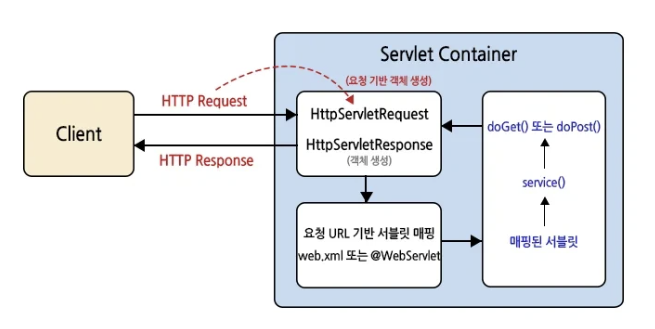
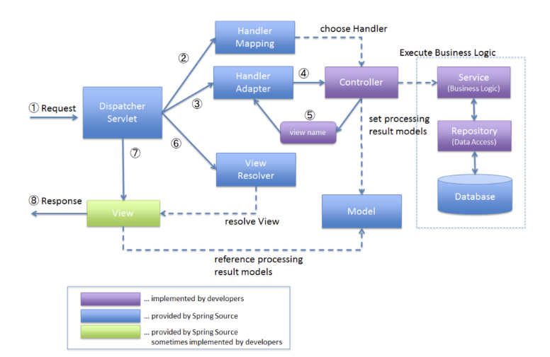

# Chapter03. Spring Boot란?


## 1. 학습 후기
이번 3주차에는 스프링의 핵심인 IoC/DI부터 서블릿, AOP까지 방대한 이론을 학습했다. 
한꺼번에 많은 개념이 쏟아지다 보니 아직은 전체적인 숲을 보기보다 하나하나의 나무를 
이해하는 데 급급한 느낌이 든다. 하지만 이론적으로 객체 간의 결합도를 낮추고 제어권을 
프레임워크에 넘기는 이유(IoC)와 구체적인 방법(DI)들에 대해 깊이 고민을 해볼 수 있는 시간이었다.

앞으로는 파편화되어 있는 이론들이 실제 코드에서 어떻게 돌아가는지, 직접 실습을 통해 서비스의 흐름을 
직접 체감하면서 숲을 그려나가는 과정을 가져보는 게 좋을 것 같다.


## 2. 핵심 키워드 정리 (SOLID 원칙이란?, DI란?, IoC란?, 생성자 주입 vs 수정자, 필드 주입 차이는?, AOP란?, 서블릿이란?)
## SOLID원칙이란?
SOLID 원칙이란 객체지향 설계에서 지켜줘야 할 5개의 소프트웨어 개발 원칙을 말한다.

이 5가지 원칙들은 서로 독립된 개별적인 개념이 아니라 서로 개념적으로 연관되어 있다. 
원칙 끼리 서로가 서로를 이용하기도 하고 포함하기도 한다.

### SRP(Single Responsibility Principle): 단일 책임 원칙
- 클래스(객체)는 단 하나의 책임만 가져야 한다는 원칙. (책임 = 기능 담당)
- 즉, 하나의 클래스는 하나의 기능을 담당하여 하나의 책임을 수행하는데 집중되도록 클래스를 따로따로 여러개 설계하라는 원칙.
- ex) 하나의 클래스에 기능(책임)이 여러개 있다면 기능 변경(수정)이 일어났을 때 수정해야할 코드가 많아진다.
- 프로그램의 유지보수 성을 높이기 위한 설계기법

### OCP(Open Closed Principle): 개방 폐쇄 원칙
- 확장에 열려있어야 하며, 변경(수정)에는 닫혀있어야 한다.
- 기능 추가 요청이 오면 클래스를 확장을 통해 쉽게 구현하면서, 확장에 따른 클래스 수정은 최소화 하도록 프로그램을 작성해야 하는 설계 기법이다.
- 확장에 열려있다.: 새로운 변경 사항이 발생했을 때 유연하게 코드를 추가함으로써 큰 힘을 들이지 않고 애플리케이션의 기능을 확장할 수 있다.
- 변경에 닫혀있다.: 새로운 변경 사항이 발생했을 때 객체를 직접적으로 수정을 제한한다.
- 다형성과 확장을 가능케 하는 객체지향의 장점을 극대화하는 기본적인 설계 원칙

### LSP(Liskov Substitution Principle): 리스코프 치환 원칙
- 서브(자식) 타입은 언제나 부모 타입으로 교체할 수 있어야 한다는 원칙
- 다형성을 생각하면 된다.
- 다형성의 특징을 이용하기 위해 상위 클래스 타입으로 객체를 선언하여 하위 클래스의 인스턴스를 받으면, 
업캐스팅된 상태에서 부모의 메서드를 사용해도 동작이 의도대로 흘러가야 하는 것을 의미하는 것이다.
- 부모 메서드의 오버라이딩을 조심스럽게 따져가며 해야한다.

### ISP(Interface Segregation Principle): 인터페이스 분리 원칙
- 인터페이스를 각각 사용에 맞게 끔 잘게 분리해야한다는 설계 원칙
- 인터페이스 분리를 통해 설계하는 원칙 (SRP는 클래스 분리를 통해…)
- 인터페이스를 사용하는 클라이언트를 기준으로 분리함으로써, 클라이언트의 목적과 용도에 적합한 인터페이스 만을 제공하는 것이 목표이다.
- *주의: 한 번 인터페이스를 분리하여 구성해놓고 나중에 무언가 수정사항이 생겨서 또 인터페이스들을 분리하는 행위를 하지 말아야한다.
(인터페이스를 한 번 구성했으면 변하면 안되는 정책 개념)

### DIP(Dependency Inversion Principle): 의존 역전 원칙
- 어떤 Class를 참조해서 사용해야하는 상황이 생긴다면, 그 Class를 직접 참조하는 것이 아니라 
그 대상의 상위 요소(추상 클래스 or 인터페이스)로 참조하라는 원칙
- 구현 클래스에 의존하는것이 아닌, 인터페이스에 의존하라는 뜻
- 의존 역전 원칙의 지향점은 각 클래스 간의 결합도(coupling)을 낮추는 것


## DI란?
- IoC가 제어권을 외부로 넘기는 것이라면, DI는 IoC를 실현하는 방법 중 하나이다.
  즉, DI는 객체가 필요로 하는 것(종속성)을 직접 만들지 않고 외부에서 주입받는 방식이다.
- ex) DI(Dependency injection)를 이해하기 쉽게 조립식 PC로 이해한다면
    - 의존성(Dependency): 컴퓨터 본체(객체)가 돌아가려면 CPU(부품)가 필요하다.
      이때 본체는 CPU에 의존한다.
    - 주입(injection): 직접 CPU를 만드는게 아닌, 다 만들어진 CPU를 가져다 꽂기만하면 된다.


## IoC란?
- 개발자가 작성한 객체나 메서드의 제어를 개발자가 아닌, 외부에서 위임하는 설계 원칙을 “제어의 역전(Inversion of Control )”이라고 부른다. 
- 소프트웨어 개발에서 중요한 설계 원칙 중 하나로, 객체나 모듈의 제어 흐름을 외부로 넘기는 것을 말한다. 
- 즉, 개발자가 프레임워크가 정해놓은 규칙과 구조에 맞게 코드를 작성하고 삽입하면, 실제 실행 흐름은 프레임워크(Spring)가 관리한다.
- OOP에서 객체가 다른 객체와 상호작용 할 때 객체 간 결합도가 높아지는 문제를 겪는데, IoC를 통해 이런 결합도를 줄일 수 있다.
- 소프트웨어의 유연성과 재사용성이 증가 → 큰 규모의 애플리케이션에서 변경 사항이 생길 때 유연하게 대처할 수 있다. 

- IoC와 DI의 차이점을 생각해보자.
  - IoC: 제어 흐름을 외부로 넘기는 추상적인 개념이다. 이는 객체가 스스로의 흐름을 관리하지 않고, 외부에서 제어를 받는 것을 의미한다.
  - DI: IoC를 구현하는 구체적인 방법 중 하나이다. DI는 객체의 의존성을 외부에서 주입함으로써 제어 흐름을 외부로 넘긴다.
  - 모든 DI는 IoC의 일종이지만, 모든 IoC가 DI는 아니다. IoC는 더 넓은 개념이고, DI는 그 중 한 가지 방식에 불과하다. DI 외에도 IoC를 구현하는 다양한 방법이 존재한다. 
  


    

## 생성자 주입 vs 수정자, 필드 주입 차이는?
- 스프링에서 의존성 주입(DI)은 객체 간 결합도를 낮추고 코드의 테스트와 유지보수를 쉽게 해주는 핵심 기술로 생성자, 수정자, 필드 주입 3가지 방식이 있다.

### 생성자 주입
- 객체를 생성하는 시점에 생성자를 통해 의존 관계를 주입한는 방식이다. 
- 클레스의 인스턴스가 생성될 때 필요한 모든 의존 객체가 인자로 전달되어야만 객체가 생성될 수 있도록 강제하는 기법이다.

```java
@Service
public class MemberSignupService {
    private final MemberRepository memberRepository; //final을 통해 절대 안 바뀌고, 
    //서비스가 작동하는 도중에 memberRepository가 바뀌거나 null이 될 일이 없다.(안전)

    // 생성자를 직접 작성하는 방식 (고전적 방식)
    @Autowired
    public MemberSignupService(MemberRepository memberRepository) {
        //서비스 객체가 만들어지려면, 반드시 MemberRepository라는 부품이 전달되어야만 한다.
        this.memberRepository = memberRepository;
    }

    /* 나머지 로직들 */
}
```
- 롬복(Lombok): 주입 받아야하는 부품(?)이 늘어나면 생성자 코드가 너무 길어진다.
  이때 사용하는 것이 @RequiredArgsConstructor 이다.

```java
@Service
@RequiredArgsConstructor // final이 붙은 필드를 모아서 생성자를 자동으로 생성
public class MemberSignupService {

    private final MemberRepository memberRepository;
    private final MailService mailService; // 부품(?)이 늘어나도 생성자를 직접 고칠 필요 없음

    /* 나머지 로직들 */
}
```

이해하기 쉽게 로봇에 비유를 해보았다.
로봇(객체)이 공장에서 만들어질 때(생성자)부터 팔다리를 다 붙여서 나오는 방식이다.
장점:
- 한 번 붙인 팔은 절대 안 떨어진다.(final 키워드를 사용했기 때문)
- 로봇 팔이 없으면 공장에서 출고(객체 생성) 자체를 못하기 때문에 에러를 미리 막을 수 있다.


### 수정자(Setter) 주입
자바의 Setter 메서드에 @Autowired 어노테이션을 붙여서 의존 관계를 주입하는 방식.
객체 생성과 의존 관계 주입이 분리되어 일어나는 것이 특징이다.
- 호출 시점: 객체 생성(생성자 호출)이 끝난 직후, 스프링이 의존관계를 파악하여 set 메서드를 호출한다.
- 가변성: 언제든지 set 메서드를 다시 호출하여 의존 객체를 변경할 수 있다.
- 객체 생성 후 값이 할당되기 때문에, 필드에 final 키워드를 붙일 수 없다.

```java
 @Service
 public class MemberSignupService { //객체 생성
 private MemberRepository memberRepository;

	@Autowired //의존성 탐색
	public void setMemberRepository(MemberRepository memberRepository) {
			this.memberRepository = memberRepository;
	}
/*setMemberRepository 메서드를 호출하면서, 파라미터로 관리중인
MemberRepository 빈을 전달하여 필드에 대입한다.*/

	/* 나머지 로직들 */
}
```

수정자 또한 이해하기 쉽게 로봇에 비유를 해보았다.
로봇 몸체만 먼저 만들고, 나중에 필요할 때 팔을 끼웠다 뺐다 할 수 있는 구멍을 만드는 방식이다.
장점으로는 로봇이 살아있는 동안 (실행 중) 부품을 자유롭게 갈아끼울 수 있다.
(But,  실제 개발에서는 푸품을 갈아 끼우는 일이 거의 없다.)


### 필드 주입
클래스의 멤버 변수(필드)에 직접 @Autowired  어노테이션을 붙여서 의존 관계를 주입하는 방식이다. 
생성자나 Setter 메서드 없이 스프링 컨테이너가 마법처럼 필드에 객체를 직접 꽂아넣어준다.
- 호출 시점: 객체 생성 후, 빈의 포스트 프로세서(Post Processor) 단계에서 주입이 일어난다.
- 외부 노출 없음: 생성자나 Setter가 없으므로 외부에서 이 필드에 접근하거나 변경할 수 있는 방법이 없다.
- final 사용 불가: 객체 생성 이후에 프레임워크가 값을 주입하기 때문에, final 키워드를 사용할 수 없다. 

```java
@Service
public class MemberSignupService {

    @Autowired // 필드에 바로 어노테이션을 붙임
    private MemberRepository memberRepository;

    /* 나머지 로직들 */
}
```
- 코드가 매우 깔끔하다. 생성자도, Setter도 필요 없다.


## AOP란?
AOP(Aspect-Oriented Programming): 관점 지향 프로그래밍을 구현한 것으로, 
애플리케이션의 여러 부분에 걸쳐 나타나는 공통 관심사를 모듈화하여 코드의 중복을 줄이고 
유지보수성을 향상시키는 프로그래밍 패러다임이다. 
OOP에서 모듈화의 핵심 단위가 “클래스”라면, AOP에서 핵심 단위는 “관점”이다.

- Target: AOP를 적용할 대상 
- Aspect: 흩어진 공통 기능을 하나로 모은 모듈
- Advice: 실질적인 부가 기능 코드와 언제 실행할지(메서드 실행 전/후 등)
- Join Point: Advice가 적용될 수 있는 모든 지점 (메서드 호출, 필드 값 변경 등)
- Pointcut: Join Point 중에서 실제로 Advice를 적용할 지점을 선별하는 규칙

-AOP가 쓰이는 사례-
- 트랜잭션 관리 (@Transactional): DB 작업을 하다가 에러가 나면 롤백을 해야한다. 
  메스드 시작 할 때 DB 연결하고 끝날 때 커밋하는 반복적인 작업을 스프링이 AOP로 처리해준다.
- 보안 체크: 이 사용자가 관리자인지 확인하는 로직을 모든 컨트롤러에 넣는 대신, AOP로 한 번에 처리한다.
- 로그 및 성능 모니터링: “모든 API의 살행 시간을 로그로 남겨줘” 같은 요청을 AOP 코드로 해결한다.


## 서블릿이란?
자바를 사용하여 웹 페이지를 동적으로 생성하는 서버 측 프로그램이다.

클라이언트의 HTTP 요청을 해석하고, 그에 맞는 자바 코드를 실행한 뒤, 결과를 다시 HTTP 응답으로 돌려주는 웹의 관문 역할을 한다.

- 서블릿이 필요한 이유: 웹서버는 정적인 페이지(HTML, 이미지)만 줄 수 있다. 하지만 예를들어, 로그인한 사용자마다 다른 화면을 보여주려면,
                     서버에서 로직(Java)이 돌아가야 한다. 그 연결 고리가 바로 서블릿이다.
- 생명주기(Life Cycle) 관리: 서블릿은 객체의 생성부터 소멸까지 서블릿 컨테이너가 관리한다.
  - init(): 서블릿이 처음 만들어질 때 1번 실행
  - service(): 요청이 올 때마다 실행 (실제 로직)
  - destroy(): 서블릿이 종료될 때 1번 실행
- 멀티 스레드 지원: 예를들어, 사용자 요청이 100개 오면, 서블릿 컨테이너가 스레드를 100개 만들어서 효율적으로 처리해준다.
- 비즈니스 로직 집중: 개발자가 복잡한 네트워크 소켓 통신을 몰라도, HttpServletRequest, HttpServletResponse 객체만 다루면 된다.



서블릿 & 서블릿 컨테이너 동작 과정에 대해 살펴보자.
1. 요청 접수: 웹 서버는 클라이언트로부터 요청을 받아 서블릿 컨테이너에 해당 요청을 위임한다.
2. 객체 생성: 서블릿 컨테이너(Tomcat)는 HttpServletRequest, HttpServletResponse 객체를 생성한다. 이때 HttpServletRequest는 받은 요청을 기반으로 만들어진다.
3. 서블릿 매핑: 설정 파일(web.xml) 또는 @WebServlet 어노테이션을 통해 해당 요청을 처리할 서블릿을 매핑하고, 매핑된 서블릿에 HttpServletRequest, HttpServletResponse를 전달한다.
4. 로직 실행: 매핑된 서블릿은 service() 메서드를 호출하고 GET, POST 여부에 따라 내부적으로 doGet(), doPost() 등의 메서드를 호출하여 처리된 결과를 HttpServletResponse에 담는다.
5. 응답 전송: HttpServletResponse를 웹 서버를 통해 클라이언트에게 반환하고 응답을 종료한다.
6. 응답이 종료된 후 HttpServletRequest, HttpServletResponse를 소멸시킨다.


## 3. 미션
### 스프링의 전반적인 요청, 응답 흐름을 설명하시오. 


1. Request:
   사용자가 브라우저에서 버튼을 누르면 HTTP 요청이 서버로 날아온다.
2. Dispatcher Servlet ↔ Handler Mapping:
- Dispatcher Servlet은 모든 HTTP 요청을 가장 먼저 받는 중앙 접점이다. 서블릿 컨테이너(Tomcat)로부터 요청을 넘겨받아 전체 프로세스를 제어한다.
- Dispatcher Servlet은 HandleMapping에게 URL 요청을 처리할 컨트롤러가 누구인지 묻는다.
  (@RequestMapping 이나 @GetMapping 어노테이션 정보를 바탕으로 담당 Controller를 찾는다.)
3. Dispatcher Servlet ↔ Handler Adapter
- 찾아낸 컨트롤러를 직접 실행하는 것이 아니라, 중간에 HandlerAdapter를 거친다.
  (왜냐하면 컨트롤러의 구현 방식이 다양할 수 있기 때문에, 이를 공통된 방식으로 실행할 수 있게 해주는 유연한 연결 고리 역할을 한다.)
4. Controller ↔ Service ↔ Repository
- 실제 개발자가 작성한 로직이 실행된다.
- Model: 요청을 처리한 결과 데이터를 담는 바구니
- Service/Repository: 데이터베이스 연산 및 복잡한 비즈니스 규칙을 수행하여 결과를 Controller에게 전달한다.
5. Controller → View Name 반환
- Controller는 처리를 마친 후, 화면에 보여줄 데이터(Model)와 화면의 이름인 View Name을 반환한다.
6. Dispatcher ↔ View Resolver
- DispatcherServlet은 논리적 이름을 받고, 이를 실제 물리적인 경로로 변환해주는 ViewResolver를 호출한다.
7. Dispatcher Servlet → View
- 결정된 View에 Model을 주입하여 최종적으로 사용자가 볼 수 있는 HTML 페이지를 생성한다.
8. Response
- 완성된 HTML을 HTTP 응답 메시지에 담아 클라이언트(브라우저)에게 전송하며 마무리된다.


## 4. 추가 학습
- 스프링의 요청, 응답 흐름을 공부하면서 흐름 이해를 위해 간단한 코드 작성.

- [Controller] - HelloController.java
```java
package com.aim.springflowpractice.controller;
import org.springframework.web.bind.annotation.GetMapping;
import org.springframework.web.bind.annotation.RestController;
import com.aim.springflowpractice.service.HelloService;
import lombok.RequiredArgsConstructor;

//Controller는 요청을 받고 응답을 결정하는 "제어장치"이다.
//주요 역할 3가지
//1. 요청 수신(Input): 사용자가 보낸 HTTP 요청(URL, 파라미터 등)을 가장 먼저 받는다.
//2. 업무 배분: 본인이 직접 복잡한 계산을 하지 않는다. 대신 Service라는 전문가에게 "이 일좀 처리해줘"라고 일을 시킴
//3. 응답 반환(Output): 서비스가 처리해온 결과를 받아, 사용자에게 어떤 화면(HTML)이나 데이터(JSON)로 보여줄지 최종 결정

@RestController //이 클래스가 스프링 MVC의 Controller임을 선언한다.
@RequiredArgsConstructor // final이 붙은 필드를 모아서 생성자를 자동으로 만들어준다.
//Lombok의 역할:@RequiredArgsConstructor는 생성자를 자동으로 작성해주는 역할!!
//spring의 역할: 만들어진 생성자를 보고, spring(IoC컨테이너)이 컨트롤러를 만들려면 HelloService가 필요하구나! 판단해서 객체를 넣어줌
//결론: 생성자를 만드는 건 Lombok + 생성자를 통해 실제로 주입하는건 spring = 생성자 주입 방식의 DI

public class HelloController {
  private final HelloService helloService; //제어권은 내가(HelloController) 갖지만, 실제 일은 서비스가 한다.(의존성 주입!!)

  @GetMapping("/hello") //HandlerMapping에 기록될 주소.
  // 브라우저 주소창에 .../hello라고 치면 이 메서드를 실행하라고 스프링에게 알려주는 역학
  public String sayHello(){ //실제로 실행될 로직이다. return 값이 그대로 화면에 찍힌다.
    // return "첫 실습이다."; 이건 Service를 만들기 전 Controller가 문자열을 바로 뱉음
    return helloService.getHelloMessage();
  }
}
```

- [Service] - HelloService.java
```java
package com.aim.springflowpractice.service;

import com.aim.springflowpractice.repository.HelloRepository;
import lombok.RequiredArgsConstructor;
import org.springframework.stereotype.Service;

@Service //나는 비즈니스 로직을 담당하는 Service
@RequiredArgsConstructor // 생성자 주입(DI)을 사용한다.
public class HelloService {

    private final HelloRepository helloRepository; //창고 부품 조립

    public String getHelloMessage(){
        //실제 로직: 데이터를 가공하거나 계산하는 등의 작업이 여기서 일어난다.
        String data = helloRepository.getData(); //창고에서 재료 가져오기
        //return "Service가 계산한 결과!!";
        return "Service가 가공한 결과물: [" + data + "]";
    }
}
```

- [Repository] - HelloRepository.java
```java
package com.aim.springflowpractice.repository;

import org.springframework.stereotype.Repository;

@Repository //"나는 데이터에 접근하는 창고다."

public class HelloRepository {
    public String getData(){
        // 여기서 진짜 DB의 데이터(MySQL등)를 꺼내오면 된다.
        return "DB에서 꺼낸 데이터...";
    }

}
```


