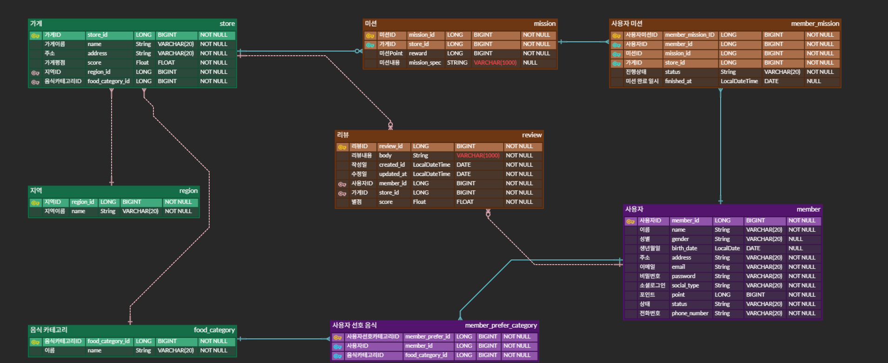
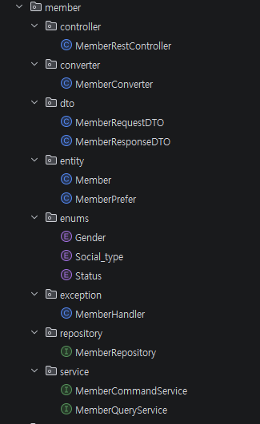
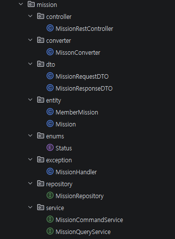
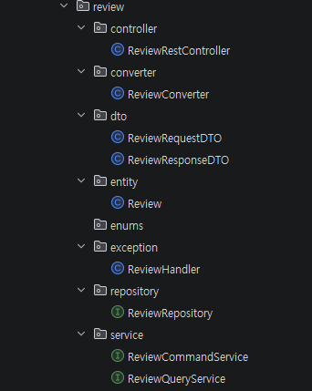
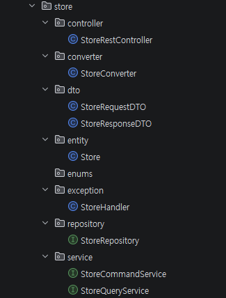

# Chapter04_프로젝트 세팅하기 - 아키텍처 구조, Swagger

## 1.학습 후기
도메인 기반 구조를 적용해보니 패키지가 많아져 초기 구성은 번거로웠지만, 향후 유지보수나 서비스 분리 시 강력한 장점이 될 것임을 체감했다.
특히 도메인 경계가 모호한 기능을 어디에 배치할지가 큰 고민이었는데, 이 부분은 앞으로 더 많은 사례를 접하며 나만의 기준을 세워나가야 할 숙제인 것 같다.
또한 아직까지 DDD와 도메인형 아키텍처의 차이점이 모호하다는 생각이 들어, 이 부분을 조금 더 찾아봐야할 것 같다.

## 2. 핵심 키워드 정리

### 1. 아키텍처 구조란?
소프트웨어 시스템에 대해 추론하는데 필요한 구조들의 집합이며, 그로한 구조와 시스템을 만드는 규율이다.
각 구조는 소프트웨어 요소, 요소 간의 관계, 그리고 요소와 관계 모두의 속성으로 구성된다.
조금 쉽게 얘기하자면 프로젝트 뼈대를 어떻게 구성할지 미리 설계하는 것이고, 다른 사람(팀원, 제 3자)이 단번에 이해하고
불필요한 의사소통이 없도록 깔끔하게 설계하는게 중요하다 + 유지보수

비유: 도시를 만들 때 주거 지역, 상업 지역을 나누고 도로를 놓는 계획과 같다.

아키텍처 구조에는 계층 기반 구조와 도메인 기반 구조가 있다.
- 계층 기반: 역할에 따라 층을 나누는 방식
- 도메인 기반: 비즈니스 기능을 기준으로 나누는 방식

### 2. Swagger란?
개발한 API들의 목록을 확인하고 테스트 할 수 있는 프레임워크. 즉, API를 구현하면 그에 맞춰 자동으로 문서화해주는 도구라고 보면 된다.

보통 개발자가 API를 만들면, 프론트엔드 개발자에게 "이 주소로 이런 데이터를 보내면 이런 결과가 나와야 합니다.!!" 라고 알려줘야 한다.
예전에는 이걸 메모장이나 엑셀에 직접 작성해서 줬는데, Swagger는 이를 웹 화면으로 자동으로 생성해준다.

### 3. 도메인형 아키텍처란?
프로젝트를 계층이 아닌 비즈니스 주제 단위로 나누는 구조이다.
- 구조: 미션에서 작성한 것처럼 Member, Mission, Store 등 단위로 나누는 구조
- 특징: 각 도메인 패키지 안에 해당 기능을 위한 Controller, Service, Entity 등이 모두 들어가 있다.
- 장점: 특정 기능을 수정해야할 때 해당 도메인 폴더만 보면 되기 때문에, 응집도가 높고 코드를 찾기에 매우 편리하다.
- 단점: 프로젝트 전체적인 구조를 파악하기에는 조금 복잡할 수 있다.

### 4. DDD vs 도메인형 아키텍처
DDD의 핵심 포인트는 기술보다 비즈니스(도메인) 그 자체가 가장 중요한 것이다.
-DDD 특징-
- 유비쿼터스 랭귀지(Ubiquitous Language)
  - 개발자와 도메인 전문가와 동일한 용어와 개념을 사용하도록 합의 -> 코드와 모델에 반영
- 바운디드 컨텍스트(Bounded Context)
  - 도메인이 여러 하위 영역으로 나뉘어 있을 때, 각 영역을 경계(Context)로 구분하고 독립된 모델을 유지하는 개념

도메인형 아키텍처의 핵심 포인트는 관련 있는 기능끼리 한 폴더에 모아두는 것이다.
-도메인 아키텍처 특징-
- 미션에서 작성한 Member, Mission, Store 처럼 폴더를 비즈니스 단위로 나눈다.
- 계층형의 단점을 보완할 수 있다.

간단하게, 비즈니스 단위로 폴더를 나눈 게 도메인형 아키텍처이고, 이건 DDD의 일부분을 빌려온 것이다.

### 5. 왜 DTO를 사용하는가?
미션에서 DTO를 하용하였다. Member 엔터티는 데이터베이스와 1:1로 매핑되는 중요한 객체이다. 이 엔터티를 프론트엔드에 직접 던져주지 않고 DTO에 담아 보냈다.
왜 DTO로 보냈는지 생각을 해보았다.
1. 보안과 노출 제어 (캡슐화)
Member 엔터티에는 민감한 정보가 들어있다.(ex. 비밀번호, 생년월일 등)
- DTO가 없다면?: Member 엔터티를 그대로 반환했다가 사용자의 비밀번호 해시값까지 프론트엔드에 노출될 수 있다.
- DTO를 사용하면 딱 필요한 내용만 담아서 보낼 수 있다.

2. 데이터 최적화 (유연성)
API마다 필요한 데이터의 모양이 다르다. 만약 어떤 화면에서는 사용자의 '이름'만 필요하고, 어떤 화면에서는 '이름 + 포인트 + 가입일'이 필요하다고 하면
하나의 엔토티로는 모든 요구사항을 맞추려면 코드가 복잡해니다. 이럴때 MemberNameResponseDTO, MemberDetailResponseDTO 처럼 여러개의 DTO를 만들면 각 화면에
맞는 데이터만 보낼 수 있다. (깔끔!!!)

3. 독립성 (유지보수 측면)
만약 엔터티를 외부에 노출했는데, 나중에 DB 설계를 바꿔서 name 컬럼을 firstName, lastName으로 바꾼다고 하면, 엔터티를 이미 노출했기에 바뀌는 순간 이 API를 쓰고 있던 
프론트엔드 코드도 다 깨져버린다. 이때 DTO를 사용하면 엔터티가 어떻게 바뀌든 중간에서 Converter가 바뀐 엔터티를 기존 DTO 모양으로 잘 조립해 주기만 하면 코드는 수정할 필요가 없다.

### 6. 컨버터를 사용하는 이유는?
가장 핵심적인 이유는 비즈니스 로직(Service)과 데이터 변환 로직을 분리하여 코드의 가독성과 유지보수성을 높이기 위함이다.
조금 더 구체적으로 왜 컨버터가 필요한지 생각을 해보자.

1. 서비스 로직의 순수성 유지 (Clean Code)
만약 컨버터가 없다면, 서비스 계층에서 엔터티를 DTO로 바꿀 때마다 new DTO()를 호출하고 set이나 builder로 값을 일일이 채우는 코드가 많이 들어갈 것이다.
회원을 가입시킨다. 라는 핵심 로직에 집중을 해야하는데 데이터를 옮겨 담는 다른 코드가 더 많아져서 코드를 읽기 힘들어진다.
여기서 컨버터를 사용한다면 return MemberConverter.toResponseDTO(member); 처럼 단 한 줄로 서비스 로직을 깔끔하게 유지할 수 있다.

2. 중복 코드 방지 및 재사용성
사용자 정보를 보여주는 API가 있는데, API가 5개라면 컨버터가 없을 땐 5개 위치에 모두 변환 코드를 작성해야한다.
나중에 DTO에 빌드가 하나 추가된다고 하면 5군데 다 찾아서 고쳐야 한다. (나라면 분명 실수함...)
컨버테에 변환 규칙을 딱 한 번만 정의해두면, 어느 서비스에서든 불러다 쓸 수 있고 수정도 컨버터 파일 하나만 하면 된다.

3. 역할 분담 (단일 책임 원칙)
객체지향 설계 원칙 중 하나의 클래스는 하나의 책임만 가져야 한다. 라는 원칙이 있다.
Service에서는 비즈니스 규칙을 실행한다는 책임이 있다면, Converter에서는 예를들어 A 데이터를 B 모양으로 바꾼다. 라는 책임을 갖는다.
역할을 나누면 에러가 났을 때 어디를 고쳐야 할지 명확해진다. 
데이터 모양이 이상하다? -> 컨버터 패키지 확인.

컨버터는 Entity와 DTO 사이를 이어주는 통역사(?)라고 생각하면 될 것 같다. 서비스가 굳이 통역일까지 하지 않도록 분리!

## 3. 미션
### ERD 결과 화면

### 설계한 아키텍처 구조

- 사용자 (Member)

- 미션 (Mission)

- 리뷰 (Review)

- 가게 (Store)

워크북에서는 아키텍처 구조를 Member, Mission, Review 구조로 작성했지만, Store을 추가하면서 패키지가 하나 더 늘어나고 관리가 조금 번거로워졌지만,
데이터가 어디에 속해 있는지 조금 더 명확하게 정의하였다.