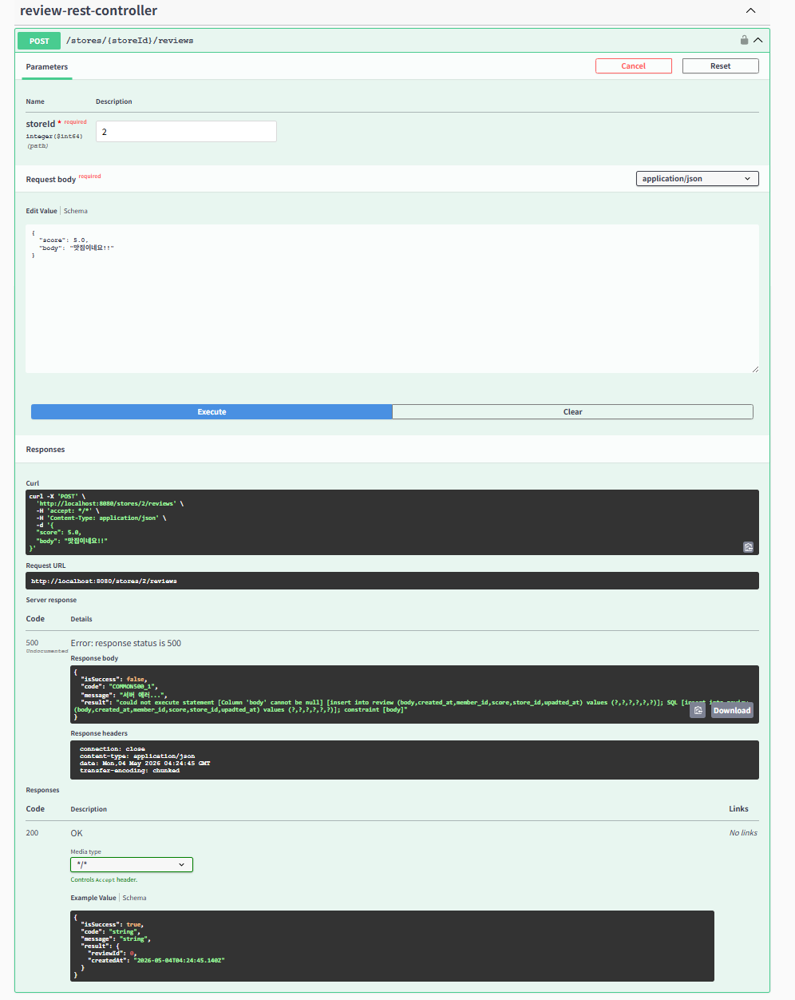
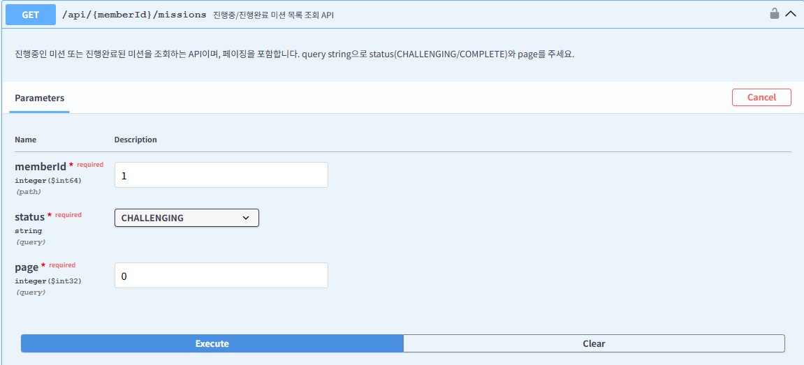
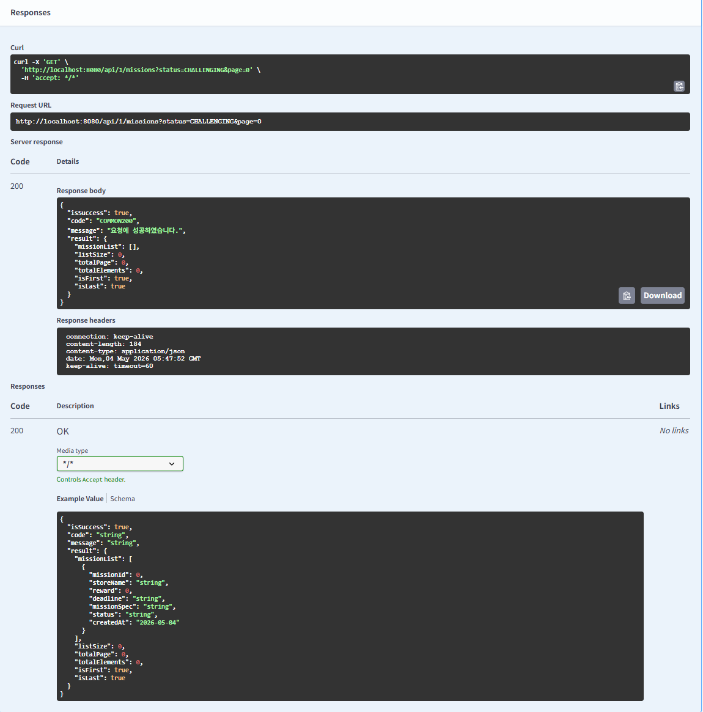

# Chapter06_API 설계 기초-JPA

## 핵심 키워드 정리

### JPA란?
JPA는 자바 진영의 ORM 기술 표준으로, 객체와 관계형 데이터 베이스 사이의 패러다임 불일치를 해결해주는 인터페이스 모음이다.
개발자가 직접 SQL을 작성하지 않아도 JPA가 대신 적절한 SQL을 생성하여 DB에 전달함으로써, 객체 지향적인 프로그래밍에만 집중할 수 있게 해준다.
즉, 자바 객체와 관계형 데이터베이스(RDBMS) 사이의 '패러다임 불일치'를 해결해주는 표준 명세이다.
자바(객체 지향) <-> DB(데이터 중심) 발생하는 구조적 차이를 JPA라는 통역사가 중간에서 맞춰준다.

장점:
- 생산성 향상: 반복적인 CRUD SQL을 직접 작성할 필요가 없다. 객체 설계 중심으로 개발이 가능하다.
- 유지보수 용이: 필드가 추가되거나 변경될 때 SQL을 일일이 수정할 필요 없이, 엔터티 클래스만 수정하면 된다.
- DB 독립성: MySQL을 쓰다가 Oracle이나 PostgreSQL로 바꿔도 쿼리를 다시 짤 필여기 없다.
- 객체 지향적인 쿼리: JPQL을 통해 테이블이 아닌 객체를 대상으로 검색할 수 있어 로직이 훨씬 직관적이다.

#### SQL 중심
``` java
String sql = "UPDATE member SET name = ? WHERE id = ?";
pstmt = conn.prepareStatement(sql);
pstmt.setString(1, "조항준");
pstmt.setLong(2, 1L);
pstmt.executeUpdate();
```

#### JPA 방식(객체 중심)
객체를 수정하면 DB가 알아서 업데이트
``` java
@Service
@Transactional
public class MemberService {
    @Autowired
    private MemberRepository memberRepository;

    public void updateName(Long id, String newName) {
        // 1. DB에서 객체를 조회한다 (영속성 컨텍스트에 저장됨)
        Member member = memberRepository.findById(id).orElseThrow();
        
        // 2. 객체의 값만 수정한다 (Dirty Checking 발동!)
        member.setName(newName);
        
        // 3. 별도의 save() 호출 없이도 트랜잭션 종료 시 UPDATE 쿼리가 날아감
    }
}
```


### N+1 문제란?
조회 시 쿼리 1개를 날렸는데, 연관된 데이터를 가져오기 위해 추가 쿼리가 N개 더 발생하는 성능 저하 현상이다.

N+1 발생 원인을 생각해보면 JPA가 JPQL을 실행할 때 연관관계 데이터를 한꺼번에 가져오지 않고, 대상 엔터티만 조회하기 때문에 발생한다.
이후 코드에서 연관된 엔터티에 접근할 때(지연 로딩) 혹은 초기 조회 시(즉시 로딩), 영속성 컨텍스트에 데이터가 없으면 각 행(N개)마다 추가로 SELECT 쿼리를 날리게 된다.

Member와 MemberPrefer 관계로 예를 들어보면,
``` java
// 1. 모든 멤버를 조회한다. (쿼리 1번 실행)
// SELECT * FROM member;
List<Member> members = memberRepository.findAll(); 

// 2. 루프를 돌며 각 멤버의 선호 카테고리 이름을 출력한다.
for (Member member : members) {
    // 여기서 각 멤버마다 MemberPrefer를 조회하는 추가 쿼리가 발생한다. (쿼리 N번 실행)
    // SELECT * FROM member_prefer WHERE member_id = ?;
    System.out.println(member.getMemberPreferList().get(0).getFoodCategory().getName());
}
```
결과: 멤버가 100명이면 총 101번(1+100)의 쿼리가 실행된다. -> DB에 엄청난 부하.

해결방법:
- Fetch Join: JPQL에서 JOIN FETCH 문법을 사용하여 DBㅇ에서 조인된 데이터를 한 번에 가져오도록 강제한다.
- @EntityGraph: 어노테이션을 통해 특정 연관관계를 한 번에 가져오도록 설정.


### 지연로딩과 즉시로딩의 차이는?
- 지연 로딩(LAZY): 연관된 엔터티를 실제 사용하는 시점에만 조회 쿼리를 날리는 방식이다. 
- 즉시 로딩(EAGER): 엔터티를 조회할 때 연관된 엔터티도 함께 조회하는 방식이다.

1. 즉시로딩(EAGER)
``` java
@ManyToOne(fetch = FetchType.EAGER) // 즉시 로딩 설정
@JoinColumn(name = "member_id")
private Member member;
```
memberPreferRepository.findById(1L) 호출 시, Member 정보가 당장 필요 없더라도 SQL에서 JOIN을 걸어 Member 데이터까지 한 번에 가져온다.
여기서 문제점이 있는데, 연관된 테이블이 많아질수록 조회 쿼리가 기하급수적으로 복잡해지고 성능이 저하된다.


2. 지연로딩(LAZY)
``` java
@ManyToOne(fetch = FetchType.LAZY) // 지연 로딩 설정
@JoinColumn(name = "member_id")
private Member member;
```
MemberPrefer mp = memberPreferRepository.findById(1L); 실행 시 MemberPrefer만 조회한다. member 필드에는 실제 객체 대신 프록시(가짜 객체)를 넣어둔다.
mp.getMember().getName(); 처럼 실제 멤버의 데이터에 접근하는 순간 DB에 SELECT 쿼리를 날려 데이터를 채운다.


### JPQL란?
JPQL은 엔터티 객체를 대상으로 쿼리하는 객체 지향 쿼리 언어이다. 
SQL이 데이터베이스 테이블의 컬럼을 대상으로 하는 것과 달리, JPQL은 엔터티 클래스의 이름과 그 필드(멤버 변수)를 대상으로 작동한다.
JPQL의 특징을 조금 더 살펴보면,
- 객체 지향이다 보니 테이블 대신 엔터티 객체를 조회한다.
- 특정 데이터베이스에 의존하는 SQL 문법을 직접 사용하지 않아도 JPA가 실행 시점에 해당 DB에 맞는 SQL로 번역해준다.
- SQL과 유사한 문법(SELECT, FROM, WHERE 등)을 지원하면서도 객체 그래프 탐색이 가능하다.

내가 작성한 ERD를 기준으로 Member와 MemberPrefer를 조회하는 상황을 비교해보았다.
1. 기본 조회 (SQL vs JPQL)
SQL: SELECT * FROM member m WHERE m.name = '조항준'
JPQL: SELECT m FROM Member m WHERE m.name = :name

member(테이블명) 대신 Member(클래스명)를 사용
* 대신 엔터티 별칭인 m 자체를 선택한다.

2. Repository에서의 실전 사용
``` java
public interface MemberRepository extends JpaRepository<Member, Long> {

    // 1. 파라미터 바인딩을 통한 조회
    @Query("SELECT m FROM Member m WHERE m.name = :name")
    List<Member> findByName(@Param("name") String name);

    // 2. 연관된 객체 그래프 탐색 (조인)
    // 일식(foodCategory.name)을 선호하는 멤버 리스트를 가져와
    @Query("SELECT m FROM Member m JOIN m.memberPreferList mp WHERE mp.foodCategory.name = :categoryName")
    List<Member> findByPreferCategoryName(@Param("categoryName") String categoryName);
}
```

### Fetch Join란?
Fetch Join은 JPQL에서 성능 최적화를 위해 제공하는 기능으로, 연관된 엔터티나 컬렉션을 SQL 한 번에 함께 조회하는 방법이다.
일반적인 Join이 SQL의 결과만 가져오는 것과 달리, Fetch Join은 연관된 객체 그래프를 메모리에 한번에 미리 올려둔다.

페치 조인의 특징으로는 
N+1 문제해결을 위해 페치 조인이 사용되기도 한다.
엔터티에 LAZY 설정을 했더라도, 페치조인을 사용하면 즉시 로딩(EAGER)처럼 한 번에 쿼리가 날아간다.
또한 연관된 엔터티들이 영속성 컨텍스트에 모두 올라가므로, 루프를 돌며 연관 객체에 접근해도 추가 쿼리가 발생하지 않는다.

Member와 food_category를 조회하는 상황을 가정해보았다.
1. 일반 조인 사용 시(N+1 발생)
``` java
@Query("SELECT m FROM Member m JOIN m.memberPreferList")
List<Member> findAllWithJoin();
```

결과: 멤버 정보만 가져오고, 선호 음식은 필요할 때마다 멤버 수(N)만큼 추가 쿼리가 날아간다.

2. Fetch Join 사용 시(N+1 해결)
``` java
@Query("SELECT m FROM Member m JOIN FETCH m.memberPreferList")
List<Member> findAllWithFetchJoin();
```

결과: 
``` java
SELECT m.*, mp.* 
FROM member m 
INNER JOIN member_prefer mp ON m.member_id = mp.member_id;
```
동작: 단 한 번의 쿼리로 멤버와 선호 음식 리스트를 모두 가져와 채워준다.

Fetch Join 사용 시 조심해야할 사항이 있다.
1. 기본적으로 페치 조인 대상에는 별칭을 줄 수 없다. (Alias 사용 금지)
2. 1:N 관계인 리스트를 두 개 이상 페치 조인하면 데이터가 기하급수적으로 뻥튀기되는 카테시안 곱이 발생하여 성능이 망할 수 있다.


### @EntityGraph란?
@EntityGraph는 JPA 표준에서 제공하는 기능으로, 엔터티 조회 시 함께 가져올 연관 엔터티를 어노테이션 설정만으로 지정하는 방식이다.
내부적으로는  Fetch Join과 동일하게 동작하여 N+1 문제를 해결한다.
@EntityGraph의 특징을 생각해보면,
복잡한 JPQL 문법 없이 어노테이션 속성에 필드명만 적어주면 된다.
또한 기본 메소드를 오버라이딩하여 특정 상황에서만 연관 데이터를 함께 가져오고 싶을 때 유용하다.

MemberRepository에서 멤버를 조회할 때, 선호 카테고리(memberPreferList)를 한 번에 가져오는 예시를 생각해보았다.
1. Spring Data JPA에서 사용
이는 JPQL을 직접 쓰지 않고도 메소드 이름만으로 데이터를 긁어올 수 있다.
``` java
public interface MemberRepository extends JpaRepository<Member, Long> {

    // findAll()을 호출할 때 memberPreferList까지 한 번에(FETCH JOIN) 가져와..
    @EntityGraph(attributePaths = {"memberPreferList"})
    List<Member> findAll();

    // 특정 이름으로 찾을때도 함께 가져오기
    @EntityGraph(attributePaths = {"memberPreferList"})
    Optional<Member> findByName(String name);
}
```

2. JPQL과 함께 사용
쿼리는 단순하게 유지하면서 로딩 전략만 추가하고 싶을 때 사용한다.
``` java
@EntityGraph(attributePaths = {"memberPreferList"})
@Query("SELECT m FROM Member m WHERE m.point > 100")
List<Member> findVipMembers();
```

그럼 여기서 의문이 들 때가 있다. Fetch Join vs @EntityGraph 언제 어떤걸 사용해야할까?
-  Fetch Join:
  - 조인 조건이 복잡하거나 여러 엔터티를 INNER JOIN으로 정확하게 가져와야 할 때 사용한다.
  - 보통 성능 최적화가 필요한 대부분의 복잡한 쿼리에 1순위로 고려가 된다.
- @EntityGraph:
  - 조인 조건이 단순하고, 단순히 연관된 객체 그래프를 한꺼번에 가져오는 것(FETCH)이 목적일때 사용한다.
  - 코드가 깔끔해지므로 가독성 면에서 유리하다.

### commit과 flush의 차이점은?
Flush: 영속성 컨텍스트의 변경 내용을 데이터베이스에 전송(동기화)하는 과정이다.
Commit: 데이터베이스의 트랜잭션을 끝내고 변경 내용을 최종적으로 확정 짓는 작업이다.

동작 원리를 한 번 생각해보자.
JPA는 성능 향상을 위해 수정 사항을 모았다가 한번에 처리하는 쓰기 지연 SQL 저장소를 운영한다.
``` java
@Transactional
public void flushAndCommit() {
    Member member = new Member();
    member.setName("Aim");
    
    // 1. 영속성 컨텍스트에 저장 (DB에는 아무 일 없음)
    em.persist(member); 

    // 2. flush() 강제 호출 (DB로 INSERT 쿼리가 날아감)
    // 쿼리는 날아갔지만, 다른 사용자는 아직 이 데이터를 볼 수 없음
    em.flush(); 

    System.out.println("--- 플러시 후, 커밋 전 ---");

    // 3. 트랜잭션 커밋 (DB에 최종 반영)
    // 이 시점에 DB가 데이터를 완전히 저장함
}
```

flush가 발생하면
1. 변경 감지(Dirty Checking)가 작동하여 수정된 엔터티를 찾는다.
2. 수정된 엔터티를 쓰기 지연 SQL 저장소에 등록한다.
3. 저장소의 쿼리(INSERT, UPDATE, DELETE)를 데이터베이스에 전송한다.

flush는 영속성 컨텍스트를 비우는 것이 아니다. 컨텍스트의 내용을 DB에 동기화할 뿐이다.

commit의 특징으로는 commit이 호출되면 JPA는 내부적으로 flush를 먼저 수행한 뒤, 실제 DB commit을 진행한다.


### 미션
- 엔티티를 제작하고 매핑까지 완료하기
- 화면을 구현하기 위한 서비스를 만들고 5주차에 제작한 컨트롤러와 연결하기 (페이징 부분은 @Query를 통해 구현) (구현한 뒤 Swagger 화면 캡쳐)

#### 라뷰 작성하는 쿼리



#### 내가 진행중, 진행 완료한 미션 모아서 보는 쿼리(페이징 포함)



#### 마이페이지 화면 쿼리


#### 홈 화면 쿼리 (현재 선택 된 지역에서 도전이 가능한 미션 목록, 페이징 포함)

