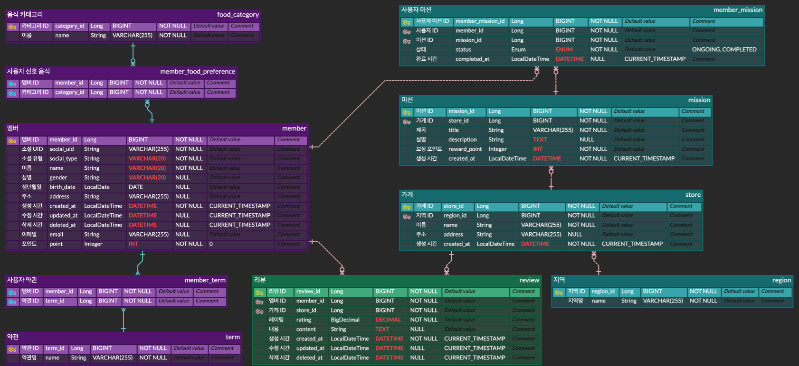
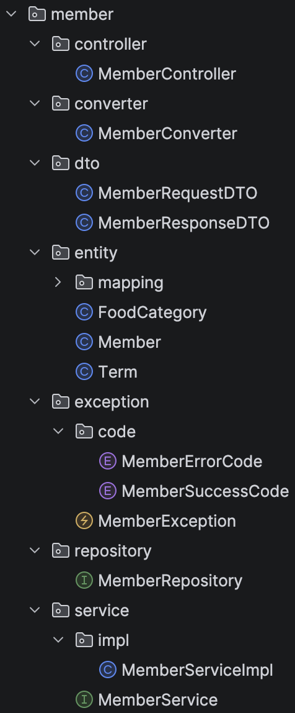
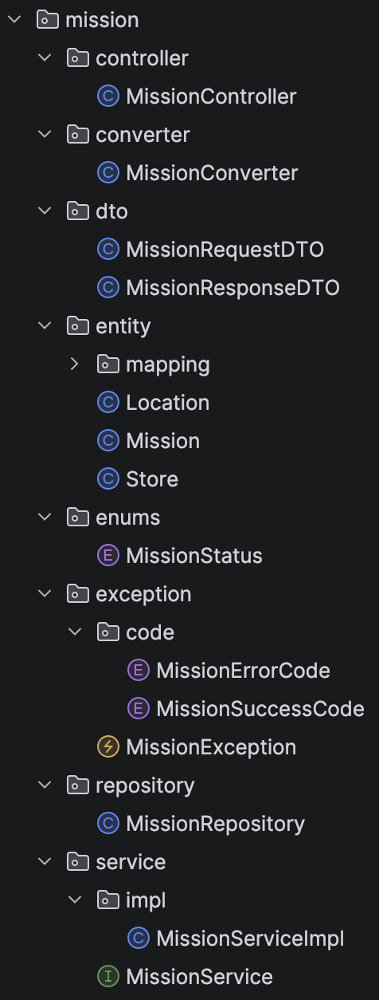
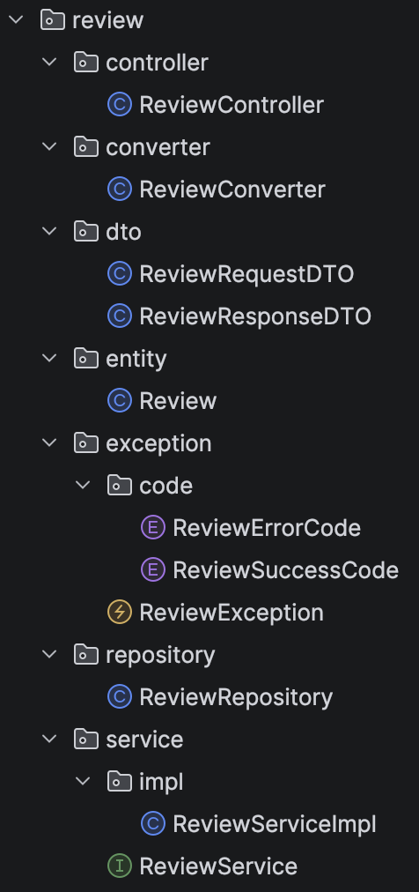

# Chapter04 미션 제출

**Name:** 리온/최형석  
**Mission:** Chapter04

---

# 1. 4주차 워크북 학습 후기

> 스프링의 아키텍처에 관한 내용을 학습하면서 어떤 식으로 프로젝트를 만들어야 할 지 윤곽이 잡히는 것 같아 좋았습니다. 이전에 만들었던 레이어 기반 구조 프로젝트들이 아닌 앞으로는 도메인 기반 구조로 프로젝트를 만들어야 겠다는 생각이 들었습니다. 또 워크북에서 제시해준 구조가 제가 알던 것과 다른 것들이 있어 새로운 부분을 많이 배울 수 있었습니다.

---

# 2. 핵심 키워드 정리

## 아키텍처 (Architecture)

> 소프트웨어 시스템(프로젝트)의 구조를 설계한 규율

다른 사람들이 바로 이해하고 어떤 구조 인지 알 수 있도록 해줌

---

### 아키텍처 적용 시 이점

- 품질 향상
- 관심사 분리
- 예측 가능성

---

### 아키텍처 구조 기본 원칙

- 단일 책임 원칙: 각 객체, 계층은 하나의 역할만 부여(요청을 받고 응답을 전달, 비즈니스 로직을 처리, DB에 저장하는 로직)
- 모듈화: 하나의 기능을 담은 코드를 모듈로 관리, 다른 객체, 계층에서 해당 기능이 필요한 경우 해당 모듈에게 지시
- 낮은 의존성: 한 부분의 변화가 다른 부분에 큰 영향을 미치지 않게 설계

---

### 스프링의 아키텍처 구조

- 레이어 기반 구조: 시스템 계층을 기준으로 코드 분류
- 도메인 기반 구조: 비즈니스 도메인을 기준으로 코드 분류

---

## Swagger

> API를 설명하고, 직접 호출까지 해볼 수 있는 도구

---

### 사용 방법

Swagger가 매핑 어노테이션을 보고 자동으로 문서 생성

- API 목록 생성
- 요청/응답 구조 분석
- UI로 보여줌

---

### **핵심 기능**

- API 문서 자동 생성
- API 테스트 UI 제공
- 요청/응답 구조 확인
- 협업 효율 증가

---

## 도메인형 아키텍처 (Domain-oriented Architecture)

> Package-by-Feature: 기능(비즈니스 도메인) 단위로 코드를 묶는 구조 방식

```
domain/
 ├ member/
 │   ├ controller
 │   ├ service
 │   ├ repository
 │   ├ entity
 │   ├ dto
 │   ├ converter
 │   ├ enums
 │   ├ exception
 │   └ exception/code
```

member라는 하나의 서비스(도메인)을 독립적으로 만든 것

---

### 등장 배경

레이어형 아키텍처

```
controller/
service/
repository/
entity/
```

문제

- 하나의 기능을 보는데 여러 패키지를 왔다 갔다 해야 함
- 관련 코드가 흩어짐
- 협업 시 충돌 많음

→ 도메인형 아키텍처

```
domain/
├ member/
├ mission/
└ review/
```

기능별로 코드가 한 곳에 모임

---

### 핵심 개념

- 도메인 중심 구조
- 응집도 증가
- 낮은 결합도
- 독립성

---

### 필요한 경우

- 기능이 많아질 때
- 팀 프로젝트일 때
- 유지보수가 중요한 서비스일 때

---

## **DDD (Domain-Driven Design)**

> 복잡한 비즈니스 로직을 도메인 중심으로 설계하는 방법론

핵심은 구조가 아니라 개념과 설계 방식

### **핵심 개념**

- 도메인 모델(Entity, Value Object)
- 유비쿼터스 언어 (팀 공통 언어)
- Aggregate
- 바운디드 컨텍스트

“코드를 어떻게 나눌까?”보다

→ “도메인을 어떻게 이해하고 모델링할까?”에 집중

---

| **구분** | **DDD** | **도메인형 아키텍처** |
  | --- | --- | --- |
| 본질 | 설계 철학 | 코드 구조 |
| 초점 | 도메인 모델링 | 패키지 구성 |

도메인형 아키텍처는 DDD를 적용하기에 적합한 구조

→ 하지만 DDD의 핵심 개념들이 있어야 완전한 DDD

---

## DTO (Data Transfer Object)

> 데이터를 패키지 간 전달하기 위한 객체

---

## 사용하는 이유

### Entity 보호

```java
@Entity
public class Member {

    @Id
    private Long id;

    private String password;

    private String name;
}
```

Member 객체를 그대로 API로 보낼 경우 패스워드 같은 민감 정보 노출됨

```java
public class MemberResponseDto {

    private String name;
}
```

DTO로 필요한 데이터만 전달

---

### API와 도메인 분리

API 변경 해도 도메인을 변경할 필요 없이 DTO를 수정하면 됨

---

### 계층 간 의존성 감소

각 계층이 덜 의존하고 구조가 더 유연해짐

---

### 성능과 명확성

엔티티 전체가 아닌 필요한 필드만 전달

→ 네트워크 비용 감수

---

## Converter (Object Mapper Pattern)

> 엔티티 ↔ DTO 변환을 담당하는 역할

## 사용하는 이유

### 변환 로직 분리

엔티티를 DTO로 변환시키는 로직을 컨트롤러가 아닌 컨버터에서 수행

- 변환 로직 따로 관리
- 유지보수 쉬움

---

### 재사용성

여러 곳에서 동일한 변환 필요

---

### 테스트 용이성

변환 로직만 따로 테스트 가능

---

### 복잡한 매핑 처리

복잡한 매핑 로직이 많아질수록 컨버터 필수

---

# 3. 추가 학습 내용

## 워크북의 도매인형 아키텍처 구조와 DDD의 관계

워크북의 구조는 전형적인 **도메인 중심 패키징**이고, DDD 의 **일부 개념을 부분적으로** 반영

---

## 워크북의 구조가 포함하고 있는 DDD의 핵심 개념

### (1) Bounded Context (경계 컨텍스트) 
member, mission, review로 도메인을 나누는 것

→ 각 도메인이 독립된 패키지 구조를 가짐

---

### (2) Entity 개념

- member, mission, review 등 식별자를 가진 객체 존재
- entity 패키지로 명시적으로 분리

---

### (3) Repository 패턴

- 각 도메인에 repository 존재
- 데이터 접근 계층 분리됨

구조적으로는 포함됨 (단, DDD 방식으로 사용되는지는 별개)

---

### (4) 도메인 기준 패키징 (모듈화)

DDD 공식 용어는 아니지만 중요한 특징
- 기능(도메인) 단위로 코드가 묶여 있음
- member 안에 controller/service/repository 포함

DDD 스타일 구조 일부 반영

---

## 워크북의 구조가 포함하고 있지 않은 DDD의 핵심 개념

### (1) Aggregate / Aggregate Root ❌

- 객체들이 묶여 있지만 Root 정의 없음
- 접근 규칙 없음 (직접 repository 접근 가능)

---

### (2) Domain Model 중심 설계 ❌

- 비즈니스 로직이 entity가 아니라 service에 있을 가능성 높음

---

### (3) Value Object ❌

- 불변 객체 개념 없음
- 전부 entity 중심 구조

---

### (4) Domain Service / Application Service 분리 ❌

- service 계층 하나로 통합되어 있음
- 역할 구분 없음

---

### (5) Ubiquitous Language ❌

- DTO, Converter, Mapping 등 기술 중심 네이밍
- 도메인 언어 기반 설계 아님

---

### (6) Aggregate 단위 Repository ❌
- repository가 entity 단위 (table 느낌)
- aggregate 단위로 동작하지 않음

---

## 워크북 구조의 장점

>DDD를 완전히 적용한 구조는 아니지만, 실무에서 많이 사용하는 현실적인 DDD 적용 형태

DDD의 “비용 높은 부분”은 의도적으로 생략

완전한 Domain-Driven Design
- Aggregate 설계 필요
- 객체에 비즈니스 로직 분산
- 모델링 난이도 높음
- 설계 시간 많이 듦

실무에서도 도메인 분리(Bounded Context) 구조 정리까지만 가져가는 경우 많음

---

## Aggregate / Aggregate Root

### Aggregate (집합)

>하나의 도메인 개념을 표현하기 위해 묶인 객체들의 집합

- Entity + Value Object들의 묶음
- 하나의 단위로 다뤄야 하는 경계(boundary)

핵심 포인트
- 내부 객체들은 강하게 연관됨
- 외부에서는 이 내부 구조를 신경 쓰지 않음

---

### Aggregate Root

>Aggregate의 대표 객체 (입구 역할)

핵심 규칙
1.	외부는 Root를 통해서만 접근 가능
2.	Root가 내부 객체들을 관리
3.	데이터 정합성(불변성)은 Root가 책임짐

---

## 도메인형 아키텍처의 도메인 나누는 기준

### 1. 기능(비즈니스 흐름) 기준으로 나눔

가장 중요한 기준
- 회원 관련 → member
- 미션 수행 → mission
- 리뷰 작성 → review

사용자가 느끼는 기능 단위 = 도메인

---

### 2. 같이 변경되는 것들을 묶음

Aggregate 개념의 약한 적용

member + term + foodCategory
→ 회원 정책/설정이 바뀌면 같이 영향 받음

---

### 3. 책임(역할)이 같은 것끼리 묶음
- member → 사용자 정보/설정 관리
- mission → 수행해야 할 작업 관리
- review → 결과/피드백 관리

각각 역할이 명확히 다름

---

### 4. 변경 이유가 다른 것은 분리

- 리뷰 정책이 바뀜 → review만 수정
- 미션 로직 변경 → mission만 수정

서로 변경 이유가 다르면 다른 도메인

---

### member 도메인
- member
- term
- foodCategory
- memberTerm
- memberFoodCategory

특징
- 사용자 설정 / 선호 / 약관
- 회원 상태 관리

---

### mission 도메인
- mission
- store
- location
- memberMission

특징
- 수행해야 할 목표
- 위치 기반 / 가게 연관

**행동** 중심

---

### review 도메인
- review

특징
- 결과 기록
- 사용자 피드백

**결과** 중심

---

## Result vs Context

>데이터가 결과인지, 아니면 행동의 조건인지에 따라 도메인 나누는 기준이 될 수 있음(모든 도메인을 이렇게 나눌 수 있는 건 아님)

### 결과(Result) → review 도메인
- 행동이 끝난 뒤 생성되는 데이터
- 기록, 피드백, 산출물

예시
- review 내용
- 평점

**이미 일어난 일**을 설명함

---

### 조건/환경(Context) → mission 도메인
- 행동이 일어나기 위해 필요한 정보
- 어디서, 어떤 상황에서 수행되는지

예시
- store (어디서)
- location (어디에서)
- mission 조건

**행동이 일어나기 전/중**에 필요함

---

**결과를 설명**하면 review, **행동의 조건**이면 mission으로 나눔

---

### 적용 결과
- store / location → mission
- review → 오직 결과만 담당

구조가 더 자연스럽고 유지보수 쉬워짐

---

## 4. 미션 기록

### ERD



### 변경점
- term, member_term 테이블 추가
- memberStatus 타입을 enum 으로 변경

### member 도메인



### mission 도메인



### review 도메인

