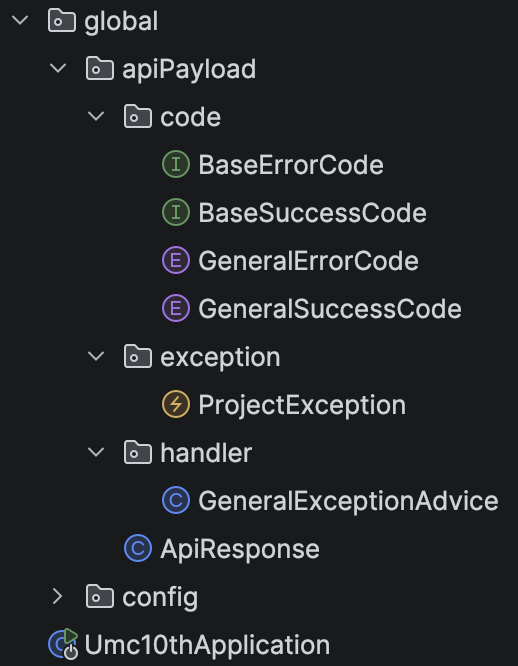
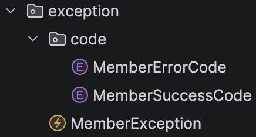

# Chapter05 미션 제출

**Name:** 리온/최형석  
**Mission:** Chapter05

---

# 1. 5주차 워크북 학습 후기

> 직접 고민해서 설계했던 API 명세서를 컨트롤러에 구현해보는 시간이라 설계의 중요성도 느끼고, 설계 뿐 아니라 구현까지 잘 돼야 좋은 프로젝트겠구나 라는 걸 느꼈습니다.

---

# 2. 핵심 키워드 정리

## 빌더패턴 (Builder Pattern)

> 객체 생성 과정을 단계적으로 분리하여 가독성과 안정성을 높이는 패턴

- 생성자 대신 `.builder()` 사용
- 체이닝 방식으로 값 설정
- 마지막에 `.build()`로 객체 생성

```java
User user = User.builder()
		.email("leon.choi.dev@gmail.com")
    .name("Leon")
    .age(20)
    .build();
```

→ 파라미터 많은 DTO 생성할 때 사용

- 스프링 부트에서는 DTO, Entity 생성 시 많이 사용

  → 특히 Lombok `@Builder`와 함께 사용

---

## record vs static class

### **record**

> 불변 데이터 객체를 간단하게 생성

- 자동으로 getter, 생성자, equals, hashCode 생성
- 모든 필드 final (불변)
- 코드가 매우 짧음

```java
public record UserDto(String name, int age) {}
```

→ 단순 응답 DTO 적합

---

### **static class**

> 커스터마이징이 가능한 전통적인 DTO 방식

- getter/setter 직접 정의 or Lombok 사용
- 유연한 구조 (가공 로직 포함 가능)
- 부분 변경 가능

```java
@Getter
@Setter
public static class UserDto {
    private String name;
    private int age;
}
```

→ 요청 DTO, 복잡한 로직 포함 DTO 적합

---

### record vs static class

> DTO 만드는 두 가지 방식

| **구분** | **record** | **static class** |
| --- | --- | --- |
| 불변성 | O | 선택 |
| 코드 길이 | 짧음 | 김 |
| 유연성 | 낮음 | 높음 |
| 용도 | 응답 DTO | 요청 DTO |

---

## 제네릭

> 타입을 일반화하여 재사용성을 높이는 문법

- `<T>` 형태로 타입 변수 사용
- 타입을 나중에 결정
- 다양한 타입을 하나의 코드로 처리

```java
public class ApiResponse<T> {
    private T data;
}
```

---

### 스프링 부트에서의 활용

- 공통 응답 객체

```java
ApiResponse<UserDto>
ApiResponse<List<UserDto>>
```

→ 응답 구조는 고정시키고 안에 들어가는 타입은 바꾸기 위해 제네릭 사용

---

## @RestControllerAdvice

> 전역 예외 처리를 담당하는 스프링 어노테이션

- 모든 컨트롤러에서 발생한 예외를 한 곳에서 처리
- `@ExceptionHandler`와 함께 사용
- JSON 형태로 에러 응답 반환

```java
@RestControllerAdvice
public class GlobalExceptionHandler {

    @ExceptionHandler(Exception.class)
    public ResponseEntity<String> handle(Exception e) {
        return ResponseEntity.badRequest().body(e.getMessage());
    }
}
```

- 코드 중복 제거
- 일관된 에러 응답
- 유지보수 쉬워짐

---

## Optional

> null 값을 안전하게 처리하기 위한 컨테이너 객체

- 값이 있을 수도 있고 없을 수도 있음
- `null` 대신 Optional 사용

```java
Optional<User> user = userRepository.findById(1L);
```

주요 메서드

```java
user.isPresent()
user.orElse(defaultValue)
user.orElseThrow()
```

---

### 스프링 부트에서의 활용

- Repository 반환값

```java
Optional<User> findById(Long id);
```

- 서비스 계층에서 예외 처리

```java
User user = userRepository.findById(id)
    .orElseThrow(() -> new RuntimeException("유저 없음"));
```

---

# 3. 미션 기록

## 응답 통일 / 에러 핸들링 객체



워크북과 동일



---

## Controller

### AuthController
```java
@RestController
@RequiredArgsConstructor
@RequestMapping("/auth")
public class AuthController {

    private final MemberService memberService;

    @PostMapping("/signup")
    public ApiResponse<MemberResponseDTO.GetMyInfo> signup(
            @RequestBody MemberRequestDTO.Signup dto
    ) {
        BaseSuccessCode code = MemberSuccessCode.OK;
        return ApiResponse.onSuccess(code, memberService.signup(dto));
    }

    @PostMapping("/login")
    public ApiResponse<MemberResponseDTO.Login> login(
            @RequestBody MemberRequestDTO.Login dto
    ) {
        BaseSuccessCode code = MemberSuccessCode.OK;
        return ApiResponse.onSuccess(code, memberService.login(dto));
    }
}
```

---

### UserController

```java
@RestController
@RequiredArgsConstructor
@RequestMapping("/users")
public class UserController {

    private final MemberService memberService;

    @GetMapping("/me")
    public ApiResponse<MemberResponseDTO.GetMyInfo> getMyInfo() {
        BaseSuccessCode code = MemberSuccessCode.OK;
        return ApiResponse.onSuccess(code, memberService.getMyInfo());
    }

    @GetMapping("/me/missions")
    public ApiResponse<List<MemberResponseDTO.MyMission>> getMyMissions(
            @RequestParam(required = false) String status
    ) {
        BaseSuccessCode code = MemberSuccessCode.OK;
        return ApiResponse.onSuccess(code, memberService.getMyMissions(status));
    }

    @GetMapping("/me/reviews")
    public ApiResponse<List<MemberResponseDTO.MyReview>> getMyReviews() {
        BaseSuccessCode code = MemberSuccessCode.OK;
        return ApiResponse.onSuccess(code, memberService.getMyReviews());
    }

    @PostMapping("/me/preferences")
    public ApiResponse<Void> setPreferences(
            @RequestBody MemberRequestDTO.SetPreferences dto
    ) {
        BaseSuccessCode code = MemberSuccessCode.OK;
        memberService.setPreferences(dto);
        return ApiResponse.onSuccess(code, null);
    }
}
```

---

### MissionController

```java
@RestController
@RequiredArgsConstructor
@RequestMapping("/missions")
public class MissionController {

    private final MissionService missionService;

    @GetMapping
    public ApiResponse<List<MissionResponseDTO.MissionInfo>> getMissions(
            @RequestParam(required = false) String status
    ) {
        BaseSuccessCode code = MissionSuccessCode.OK;
        return ApiResponse.onSuccess(code, missionService.getMissions(status));
    }

    @PostMapping("/{missionId}/start")
    public ApiResponse<Void> startMission(
            @PathVariable Long missionId
    ) {
        BaseSuccessCode code = MissionSuccessCode.OK;
        missionService.startMission(missionId);
        return ApiResponse.onSuccess(code, null);
    }

    @PostMapping("/{missionId}/complete")
    public ApiResponse<Void> completeMission(
            @PathVariable Long missionId
    ) {
        BaseSuccessCode code = MissionSuccessCode.OK;
        missionService.completeMission(missionId);
        return ApiResponse.onSuccess(code, null);
    }
}
```

---

### RegionController (Mission)

```java
@RestController
@RequiredArgsConstructor
@RequestMapping("/regions")
public class RegionController {

    private final MissionService missionService;

    @GetMapping("/{regionId}/missions")
    public ApiResponse<List<MissionResponseDTO.MissionInfo>> getMissionsByRegion(
            @PathVariable Long regionId
    ) {
        BaseSuccessCode code = MissionSuccessCode.OK;
        return ApiResponse.onSuccess(code, missionService.getMissionsByRegion(regionId));
    }
}
```

---

### StoreController (Review)

```java
@RestController
@RequiredArgsConstructor
@RequestMapping("/stores")
public class StoreController {

    private final ReviewService reviewService;

    @PostMapping("/{storeId}/reviews")
    public ApiResponse<ReviewResponseDTO.ReviewInfo> createReview(
            @PathVariable Long storeId,
            @RequestBody ReviewRequestDTO.CreateReview dto
    ) {
        BaseSuccessCode code = ReviewSuccessCode.OK;
        return ApiResponse.onSuccess(code, reviewService.createReview(storeId, dto));
    }
}
```

---

## DTO

### MemberRequestDTO

```java
public class MemberRequestDTO {

    @Getter
    public static class Signup {
        private String email;
        private String password;
        private String name;
        private String gender;
        private LocalDate birthDate;
        private String address;
        private Boolean serviceAgree;
    }

    @Getter
    public static class Login {
        private String email;
        private String password;
    }

    @Getter
    public static class SetPreferences {
        private List<Long> categoryIds;
    }
}
```

---

### MemberResponseDTO

```java
public class MemberResponseDTO {

    @Getter
    @Builder
    public static class GetMyInfo {
        private Long memberId;
        private String email;
        private String name;
    }

    @Getter
    @Builder
    public static class Login {
        private String accessToken;
        private String refreshToken;
    }

    @Getter
    @Builder
    public static class MyMission {
        private Long missionId;
        private String status;
    }

    @Getter
    @Builder
    public static class MyReview {
        private Long reviewId;
        private String content;
        private Integer rating;
    }
}
```

---

### MissionRequestDTO

API 명세서 상으로 @PathVariable @RequestParam 이 두 개면 충분함

---

### MissionResponseDTO

```java
public class MissionResponseDTO {

    @Getter
    @Builder
    public static class MissionInfo {
        private Long missionId;
        private String title;
        private String status;
    }
}
```

---

### ReviewRequestDTO

```java
public class ReviewRequestDTO {

    @Getter
    public static class CreateReview {
        private Integer rating;
        private String content;
    }
}
```

---

### ReviewResponseDTO

```java
public class ReviewResponseDTO {

    @Getter
    @Builder
    public static class ReviewInfo {
        private Long reviewId;
        private Integer rating;
        private String content;
    }
}
```