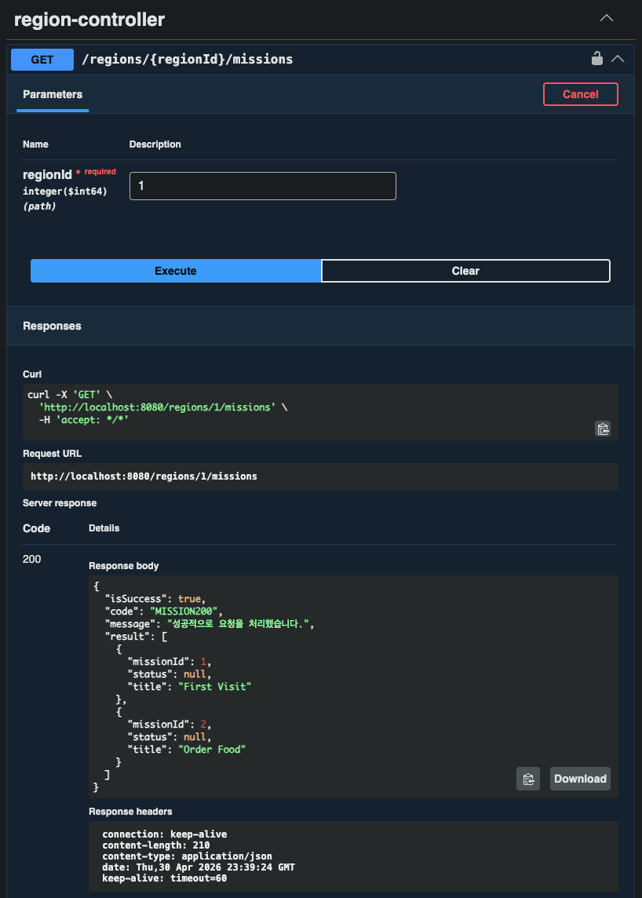
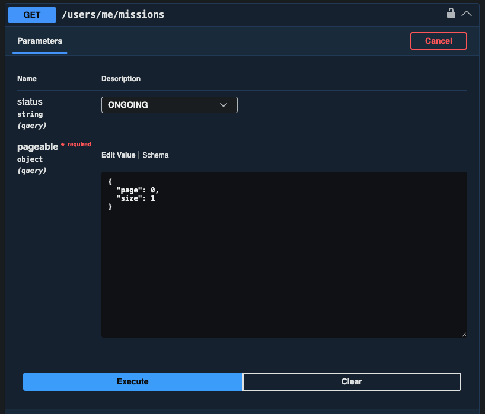
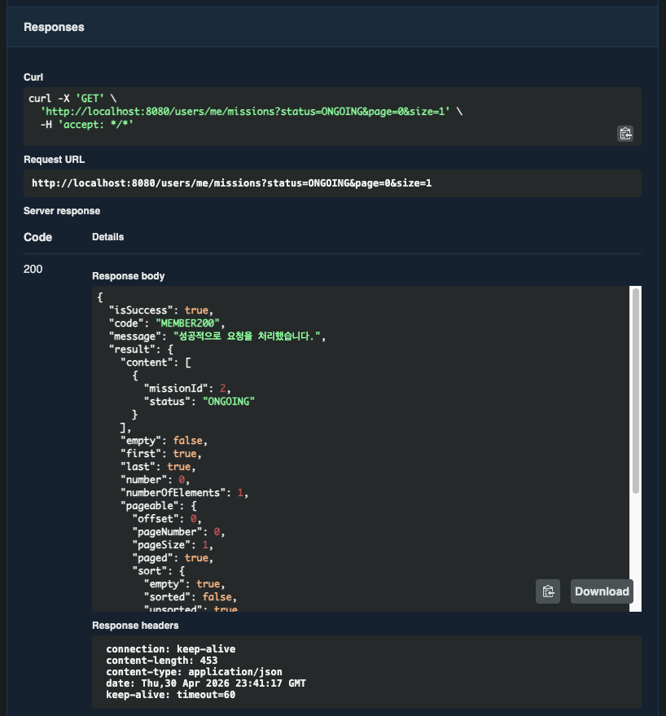
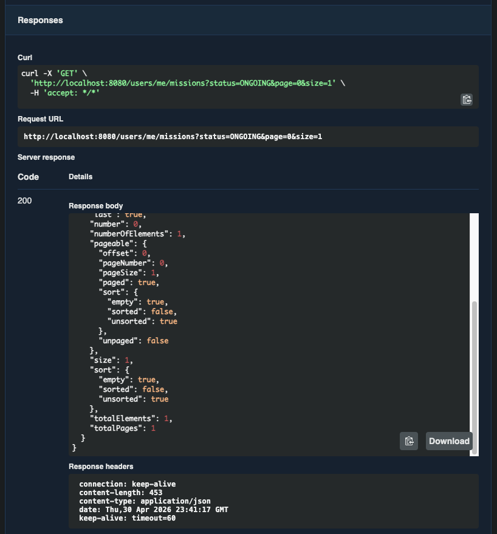
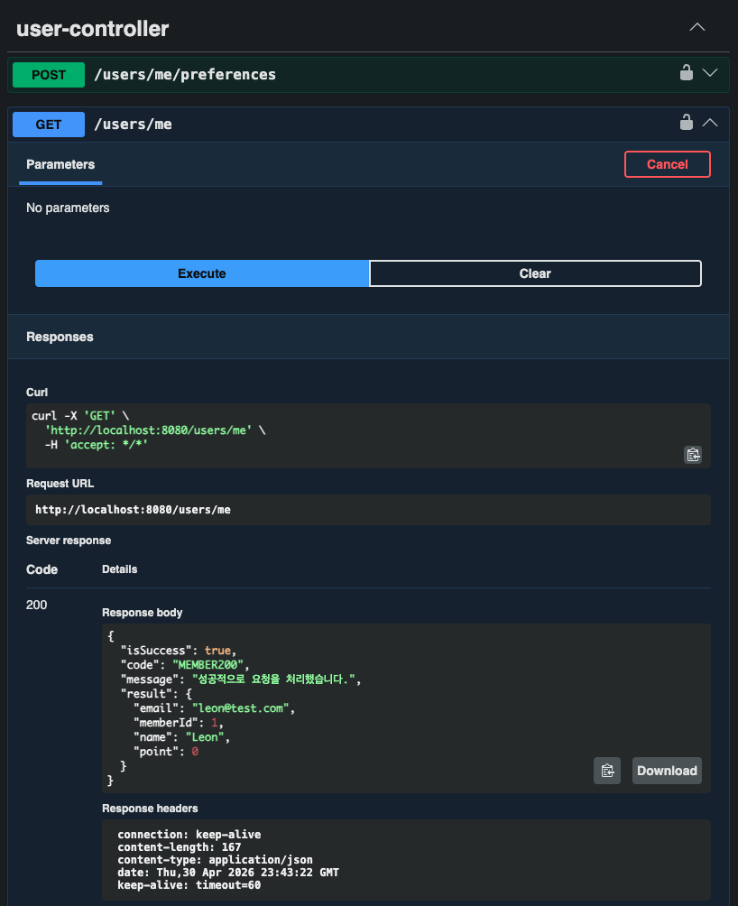
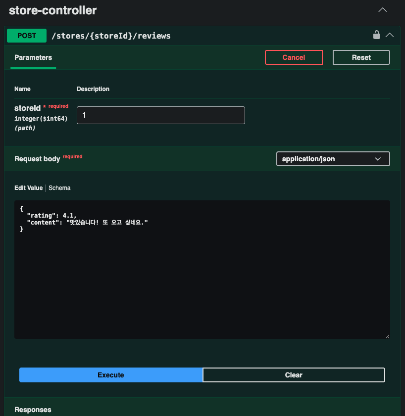
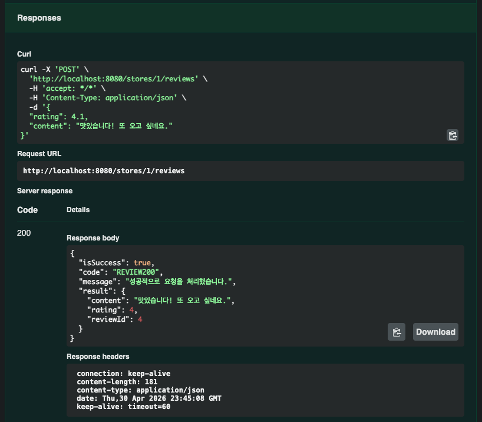

# Chapter06 미션 제출

**Name:** 리온/최형석  
**Mission:** Chapter06

---

# 1. 6주차 워크북 학습 후기

> 두 달 동안 열심히 배우면서 직접 설계해본 것들을 실제 API 로 구현하여 하나의 로직이 실행되도록 만들어보니 성취감도 느껴지고 재밌는 것 같습니다. 또한 설계 단계에서 배우고 고민했던 시간들 덕분에 구현 자체가 깔끔하게 진행되는 것 같습니다. 좋은 설계가 개발 단계에서 시간 절약같은 비용 측면에 굉장히 중요할 것 같다고 느꼈습니다.

---

# 2. 핵심 키워드 정리

## JPA (Java Persistence API)

> 자바 객체와 데이터베이스를 매핑하여 ORM 방식으로 데이터를 관리하는 기술

- 객체(Entity)를 DB 테이블과 매핑
- SQL 대신 메서드 호출로 데이터 처리
- 내부적으로 영속성 컨텍스트를 통해 엔티티 관리

```java
@Entity
public class Member { 
    @Id @GeneratedValue 
    private Long id;
    private String name;
}
```

→ 스프링 부트에서는 `Spring Data JPA`를 통해 쉽게 사용

- `JpaRepository` 상속으로 CRUD 자동 제공

---

## 영속성 컨텍스트 (Persistence Context)

> 엔티티를 관리하는 1차 캐시 공간

- 같은 트랜잭션 내에서 동일 엔티티 보장 (1차 캐시)
- 변경 감지(Dirty Checking) 자동 수행
- 트랜잭션 커밋 시 DB 반영

```java
Member member = em.find(Member.class, 1L);
member.setName("Leon"); // 변경 감지
```

→ 따로 update 쿼리 없이 자동 반영됨

---

## N+1 문제

> 연관된 엔티티 조회 시 쿼리가 불필요하게 여러 번 나가는 문제

- 1번 조회 + N번 추가 조회 발생
- 주로 지연 로딩에서 발생

```java
List<Mission> missions = missionRepository.findAll();
for (Mission m : missions) {
    System.out.println(m.getStore().getName());
}
```

→ Member 1번 + Team N번 조회

- 성능 저하의 주요 원인

---

## 지연 로딩 vs 즉시 로딩

> 연관 엔티티를 언제 조회할지 결정하는 전략

### 지연 로딩 (LAZY)

- 실제 사용 시점에 조회
- 프록시 객체로 대체

```java
@ManyToOne(fetch = FetchType.LAZY)
private Store store;
```

→ 필요할 때만 조회 (성능 최적화에 유리)

---

### 즉시 로딩 (EAGER)

- 엔티티 조회 시 함께 조회

```java
@ManyToOne(fetch = FetchType.EAGER)
private Store store;
```

→ 항상 같이 조회 (N+1 문제 발생 가능)

---

### 차이 요약

| **구분** | **LAZY** | **EAGER** |
| --- | --- | --- |
| 조회 시점 | 사용 시 | 즉시 |
| 성능 | 효율적 | 비효율 가능 |
| 추천 | O | X |

→ 스프링 부트에서는 기본적으로 LAZY 권장

---

## JPQL (Java Persistence Query Language)

> 엔티티 객체를 대상으로 하는 쿼리 언어

- 테이블이 아닌 엔티티 기준으로 조회
- SQL과 유사하지만 객체 지향적

```java
@Query("SELECT m FROM Mission m")
List<Mission> findAllMissions();
```

→ DB가 아닌 엔티티 기준으로 작성

---

## Fetch Join

> 연관 엔티티를 한 번의 쿼리로 함께 조회하는 JPQL 기능

- N+1 문제 해결 핵심 방법
- 즉시 로딩처럼 동작하지만 쿼리에서 직접 제어

```java
@Query("SELECT m FROM Mission m JOIN FETCH m.store")
List<Mission> findMissionsWithStore();
```

→ Member + Team 한 번에 조회

---

## @EntityGraph

> JPQL 없이 연관 엔티티를 함께 조회하도록 설정하는 방법

- Fetch Join을 어노테이션으로 간단하게 적용
- Spring Data JPA에서 제공

```java
@EntityGraph(attributePaths = "store")
List<Mission> findAll();
```

→ 코드 간결 + 가독성 향상

---

## flush vs commit

### flush

> 영속성 컨텍스트의 변경 내용을 DB에 반영 (쿼리 실행)

- 트랜잭션은 유지됨
- DB에는 반영되지만 확정 아님

```java
@Transactional
public void updateMissionWithFlush() {
    Mission mission = em.find(Mission.class, 1L);
    mission.setTitle("새 미션");

    em.flush(); // 여기서 UPDATE 쿼리 실행 (DB로 보냄)
    
    if (true) {
        throw new RuntimeException("에러 발생"); // 에러 발생한다면 flush 했어도 DB 반영 취소됨
    }
}
```

---

### commit

> 트랜잭션을 종료하고 변경 사항을 최종 반영

- flush 포함됨
- 실제 DB에 확정 저장

```java
public void updateMissionWithCommit() {
    EntityTransaction tx = em.getTransaction();
    tx.begin();

    try {
        Mission mission = em.find(Mission.class, 1L);
        mission.setTitle("새 미션");

        tx.commit(); // DB에 저장 (내부적으로 flush 실행)
        
    } catch (Exception e) {
        tx.rollback(); // 에러 발생 시 전체 취소
    }
}
```

---

### 차이 요약

| **구분** | **flush** | **commit** |
| --- | --- | --- |
| DB 반영 | O | O |
| 트랜잭션 종료 | X | O |
| 롤백 가능 | O | X |

→ flush는 중간 반영, commit은 최종 확정

---

# 3. 미션 기록

## 홈 화면 API



---

## 내가 진행중, 진행 완료한 미션 모아서 보는 API (페이징 포함)





---

## 마이 페이지 API



---

## 리뷰 작성 API


