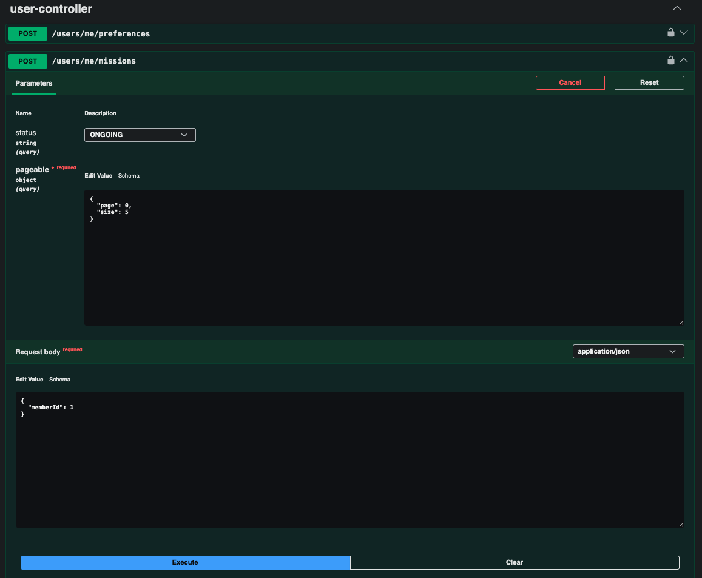
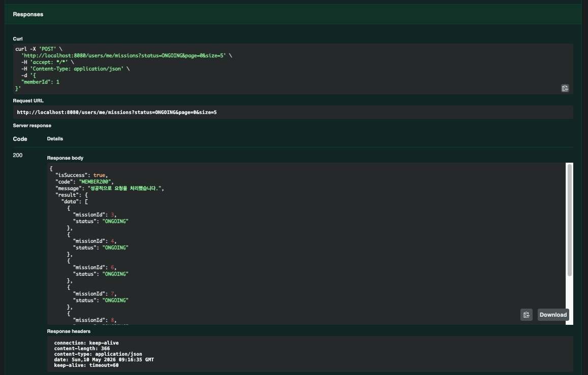
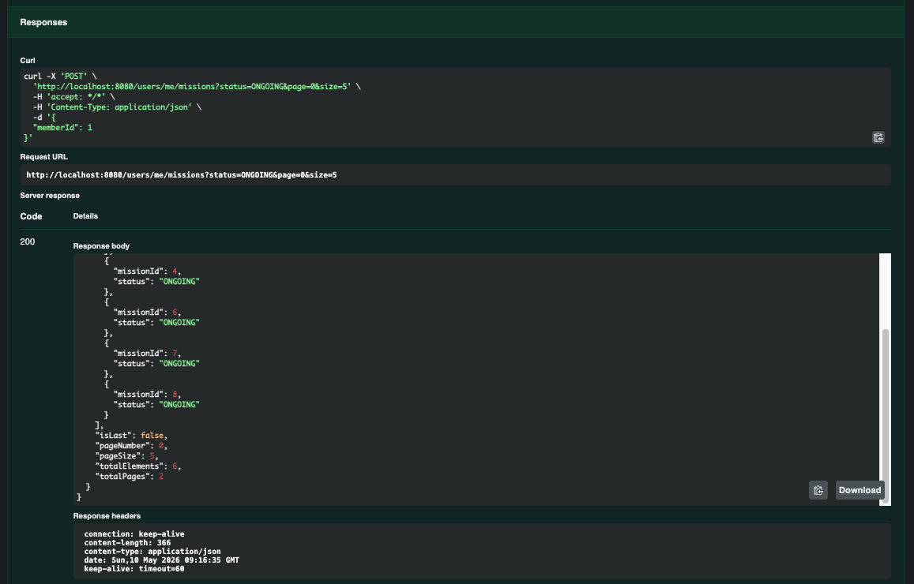
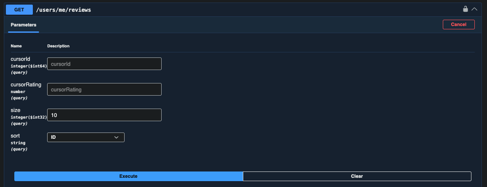
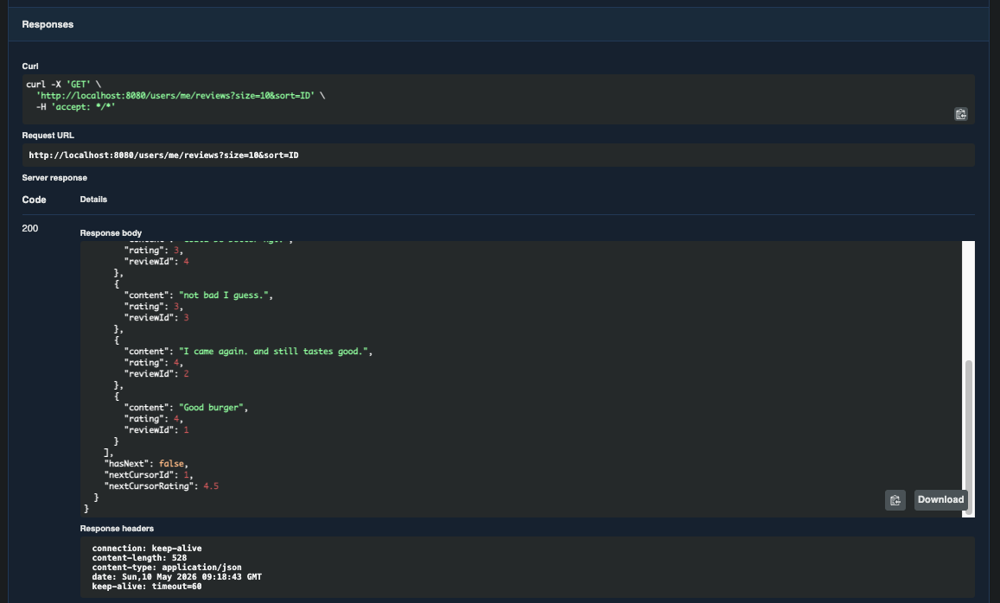
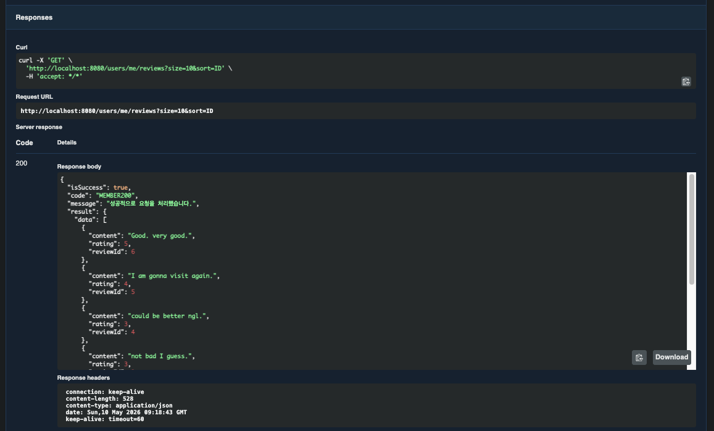
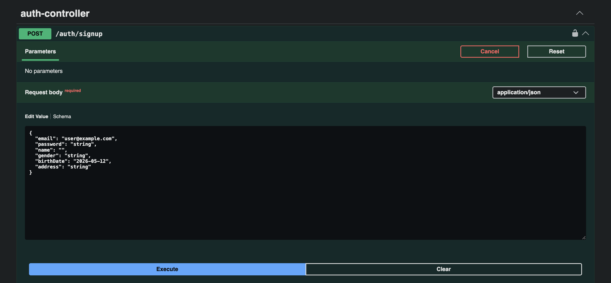
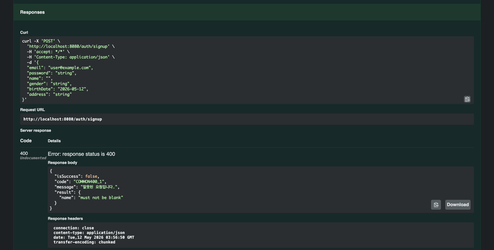

# Chapter07 미션 제출

**Name:** 리온/최형석  
**Mission:** Chapter07

---

# 1. 7주차 워크북 학습 후기

> 서버에서 조회를 처리하는 것이 실제로는 매우 중요하다는 걸 깨달았습니다. 이 과정에 필요한 페이징에 대해서도 이번 주차를 통해 자세하게 배울 수 있어 좋았습니다.

---

# 2. 핵심 키워드 정리

## Page와 Slice

> 데이터를 페이지 단위로 조회하는 방법

### Page

- 전체 데이터 개수 조회 O
- 전체 페이지 수 계산 가능
- count 쿼리가 추가로 실행됨

```java
Page<Member> members = memberRepository.findAll(PageRequest.of(0, 10));
```

- `getTotalPages()`
- `getTotalElements()`

사용 가능

→ 전체 페이지 정보가 필요할 때 사용

---

### Slice

- 다음 페이지 존재 여부만 확인
- 전체 개수 조회 X
- count 쿼리 실행 안함

```java
Slice<Member> members = memberRepository.findAllBy(PageRequest.of(0, 10));
```

- `hasNext()`

사용 가능

→ 무한 스크롤에 적합

---

### Page vs Slice

| **구분** | **Page** | **Slice** |
| --- | --- | --- |
| count 쿼리 | O | X |
| 전체 페이지 수 | O | X |
| 성능 | 상대적으로 느림 | 더 빠름 |
| 용도 | 일반 페이징 | 무한 스크롤 |

---

## Java Stream API

> 컬렉션 데이터를 선언형으로 처리하는 API

- 반복문 없이 데이터 가공 가능
- filter, map, collect 등을 사용

```java
List<String> names = members.stream()
        .map(Member::getName)
        .toList();
```

→ Member 객체 리스트에서 이름만 추출

---

### 자주 사용하는 메서드

| 메서드 | 역할 |
| --- | --- |
| filter | 조건 필터링 |
| map | 데이터 변환 |
| forEach | 반복 처리 |
| collect / toList | 리스트 변환 |

---

### filter 예시

```java
List<Member> adults = members.stream()
        .filter(m -> m.getAge() >= 20)
        .toList();
```

→ 성인 회원만 추출

---

## 객체 그래프 탐색

> 엔티티의 연관관계를 따라 객체를 조회하는 방식

- 객체 참조를 통해 연관 엔티티 접근
- JPA의 핵심 특징 중 하나

```java
Mission mission = missionRepository.findById(1L).get();

String storeName = mission.getStore().getName();
```

→ Mission → Store 객체 탐색

---

### 특징

- SQL JOIN을 직접 작성하지 않아도 객체처럼 접근 가능
- 지연 로딩(LAZY)과 함께 많이 사용됨

---

## @Valid vs @Validated

> 요청 데이터 검증을 수행하는 어노테이션

---

### @Valid

- Java 표준 검증
- 객체 내부까지 검증 가능

```java
@PostMapping
public void create(@RequestBody @Valid MemberRequest request) {
}
```

→ DTO 검증 시 가장 많이 사용

---

### @Validated

- Spring 제공 검증
- 그룹 검증 가능

```java
@Validated
@Service
public class MemberService {
}
```

→ 서비스 계층 검증, 그룹 검증에 사용

---

### @Valid vs @Validated

| **구분** | **@Valid** | **@Validated** |
| --- | --- | --- |
| 제공 | Java | Spring |
| 그룹 검증 | X | O |
| 주 사용 위치 | DTO | Service |
| 중첩 객체 검증 | O | O |

→ 일반 DTO 검증은 보통 `@Valid` 사용

---

# 3. 미션 기록

## 사용자가 진행중인 미션 조회

- 오프셋 기반 페이지네이션 응답
- 사용자 ID 는 Request Body 에서 받기





---

## 사용자가 작성한 리뷰 조회

- 커서 기반 페이지네이션 응답





---

## 검증 어노테이션

```java
@Getter
public static class Signup {

        @Email
        @NotBlank
        private String email;

        @NotBlank
        private String password;

        @NotBlank
        private String name;

        @NotBlank
        private String gender;

        @NotNull
        private LocalDate birthDate;

        @NotBlank
        private String address;

    }
```



