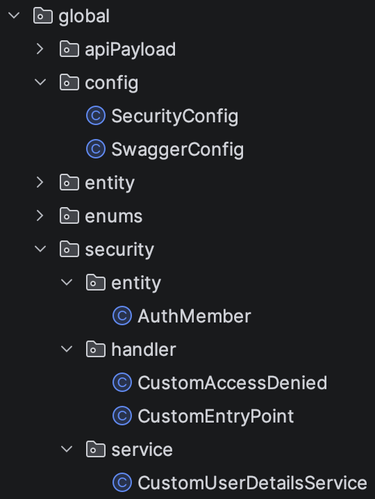
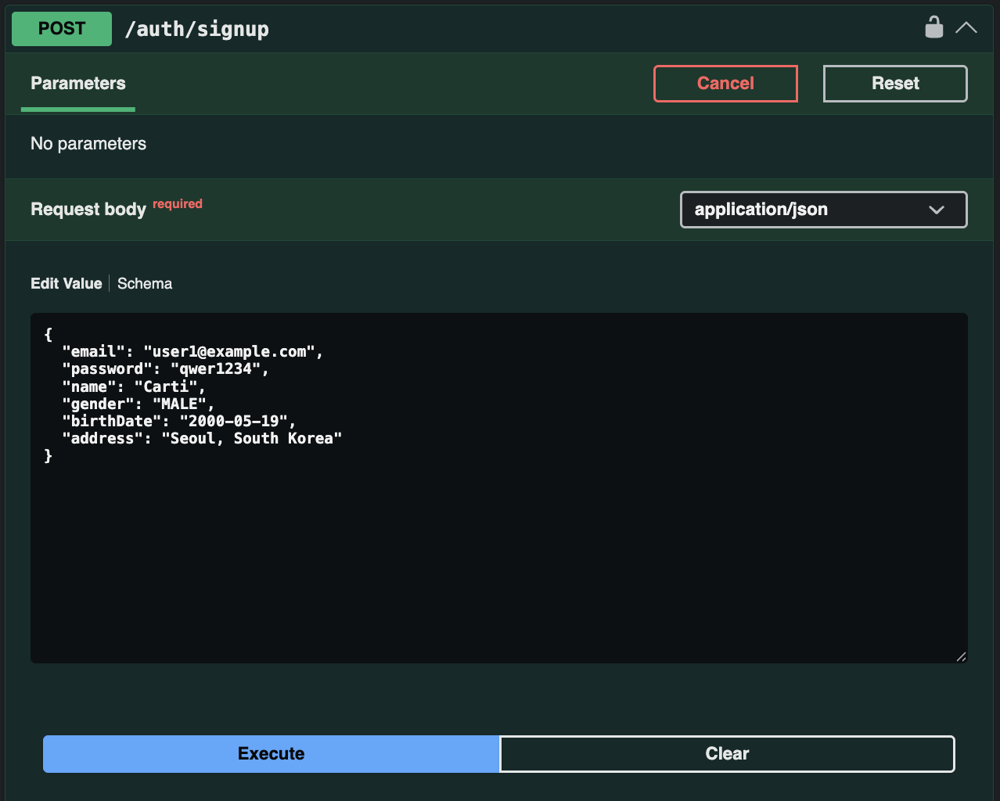
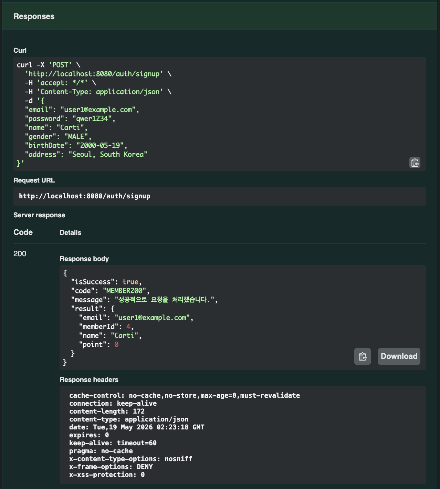
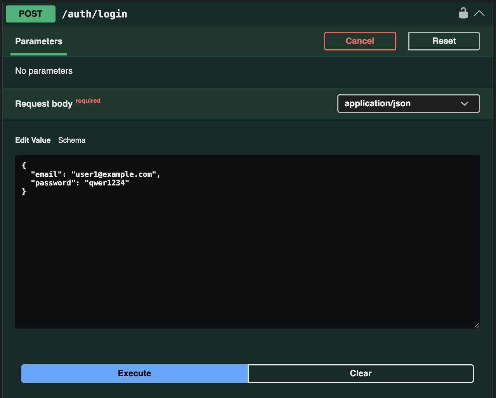
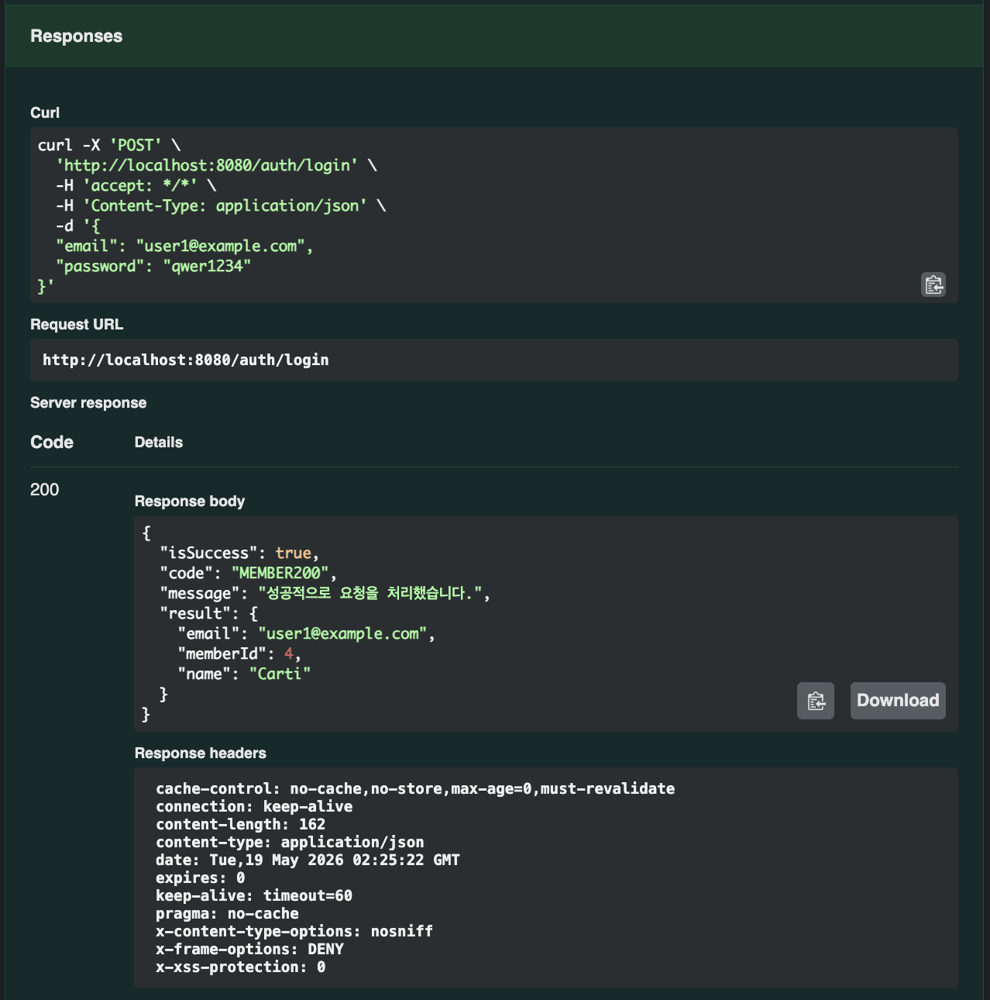
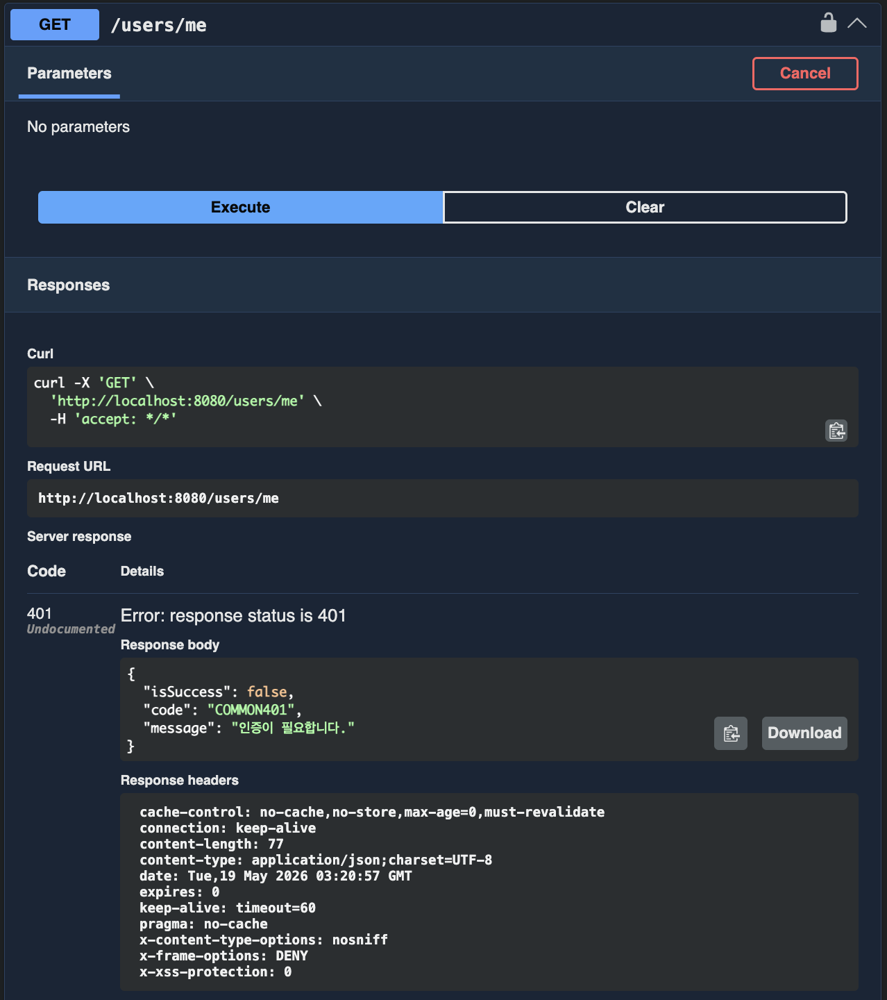

# Chapter08 미션 제출

**Name:** 리온/최형석  
**Mission:** Chapter08

---

# 1. 8주차 워크북 학습 후기

> Spring Security 가 내용이 방대하지만 유기적으로 연결되어 있기 때문에 배우기 어려우면서도 꼭 제대로 배워야겠다고 느꼈습니다. 제가 완전히 모든걸 이해하지는 못했겠지만 계속 공부하면 마스터할거라 생각하고 열심히 했습니다.

---

# 2. 핵심 키워드 정리

## Spring Security

> Spring 기반 애플리케이션의 인증과 인가를 담당하는 보안 프레임워크

### 특징

- 로그인 인증 처리 지원
- URL 접근 권한 관리 가능
- 세션 관리 기능 제공
- 비밀번호 암호화 지원
- JWT/OAuth2 같은 인증 방식과 연동 가능

```java
@Configuration
@EnableWebSecurity
public class SecurityConfig {

    @Bean
    public SecurityFilterChain filterChain(HttpSecurity http) throws Exception {

        http
                .authorizeHttpRequests(auth -> auth
                        .requestMatchers("/admin/**").hasRole("ADMIN")
                        .anyRequest().authenticated()
                )
                .formLogin(Customizer.withDefaults());

        return http.build();
    }
}
```

- `SecurityFilterChain`

  → 보안 규칙 설정

- `authorizeHttpRequests()`

  → 요청별 권한 설정

- `formLogin()`

  → 로그인 기능 활성화


→ Spring에서 가장 많이 사용하는 보안 프레임워크

---

### 동작 구조

1. 사용자의 요청 발생
2. Spring Security Filter 통과
3. 인증(Authentication) 수행
4. 인가(Authorization) 검사
5. 요청 허용 또는 차단

---

### 장점

| **장점** | **설명** |
| --- | --- |
| 강력한 보안 기능 | 인증/인가 기능 제공 |
| 확장성 높음 | JWT, OAuth2 연동 가능 |
| Spring과 통합 우수 | Spring Boot와 설정 연동 쉬움 |
| 비밀번호 암호화 지원 | BCrypt 등 사용 가능 |

---

## 인증(Authentication) vs 인가(Authorization)

> 인증은 “누구인지 확인”, 인가는 “권한이 있는지 확인”

### Authentication (인증)

- 사용자의 신원을 확인하는 과정
- 로그인 과정에 해당
- 아이디/비밀번호 검증 수행

```java
Authentication authentication =
        authenticationManager.authenticate(token);
```

예시:

- ID/PW 로그인
- JWT 토큰 검증
- OAuth 로그인

---

### Authorization (인가)

- 인증된 사용자의 권한 확인
- 특정 기능 접근 가능 여부 판단

```java
@PreAuthorize("hasRole('ADMIN')")
public void deleteUser() {
}
```

예시:

- 관리자만 접근 가능
- 특정 API 사용 제한
- 게시글 수정 권한 검사

→ “이 기능 사용할 권한 있어?” 를 확인

---

### Authentication vs Authorization

| **구분** | **Authentication** | **Authorization** |
| --- | --- | --- |
| 의미 | 사용자 확인 | 권한 확인 |
| 시점 | 로그인 시 | 요청 처리 시 |
| 목적 | 신원 검증 | 접근 제어 |
| 예시 | 비밀번호 검사 | ADMIN 권한 검사 |

---

## Stateful vs Stateless

> 서버가 사용자 상태를 저장하는지 여부의 차이

### Stateful

- 서버가 사용자 상태를 저장
- 대표적으로 Session 방식 사용
- 요청 간 사용자 정보를 유지

```java
HttpSession session = request.getSession();
session.setAttribute("user", loginUser);
```

특징:

- 서버 메모리에 세션 저장
- 로그인 상태 유지 가능
- 서버 확장 시 세션 공유 문제 발생 가능

→ 전통적인 로그인 방식

---

### Stateless

- 서버가 사용자 상태를 저장하지 않음
- 요청마다 인증 정보 포함
- 대표적으로 JWT 사용

```java
Authorization: Bearer {JWT_TOKEN}
```

특징:

- 서버가 상태 저장 안함
- 확장성 높음
- REST API에 적합
- 클라이언트가 토큰 보관

→ 현대 REST API에서 많이 사용

---

### Stateful vs Stateless

| **구분** | **Stateful** | **Stateless** |
| --- | --- | --- |
| 상태 저장 | 서버 | 클라이언트 |
| 대표 방식 | Session | JWT |
| 서버 메모리 사용 | O | X |
| 확장성 | 상대적으로 낮음 | 높음 |
| REST API 적합성 | 낮음 | 높음 |

---

# 3. 프로젝트 변경사항

## 6주차 리뷰 기반 프로젝트 수정된 항목들

### 1. 리뷰 응답 DTO, 멤버 컨버터, 리뷰 컨버터 수정 
> rating 이 BigDemical 이 아닌 Int 였던 점, 변환 과정이 이상했던 점 수정

### 2. toMyReview 리뷰를 변환하는 컨버터를 멤버 컨버터에서 리뷰 컨터버로 이동

### 3. 요청 DTO 에 기본 생성자 추가
- AccessLevel.PROTECTED 로 지정

### 4. Member 의 Gender 필드를 Enum 으로 변경

### 5. handleMemberException → handleProjectException 으로 네이밍 수정

### 6. RuntimeException 이 아닌 각자 알맞은 예외를 던지도록 변경

### 7. preference → category 로 네이밍 통일

### 8. MemberMissionRepository 에서 findMyMissions 에 countQuery 명시

### 9. Member 엔티티에서 @Builder 제거
> 정적 팩토리 메서드와 빌더를 혼용적으로 사용하던 점을 수정
- 엔티티는 정적 팩토리 메서드를 사용하도록 통일

### 10. 서비스 인터페이스와 서비스 구현체 합침
- 서비스 구현체 하나로 변경

### 11. Store 를 따로 도메인으로 분리
- 스토어, 지역 엔티티 이동 
- 스토어, 지역 리포지토리 이동 
- 스토어, 지역 컨트롤러 이동 및 서비스를 미션 서비스와 리뷰 서비스에 통합해서 컨트롤러와 서비스 분리시킴

### 12. 복합키 → 단일키 구조로 변경
> 원래 ERD 설계 상으로 복합 키를 사용해 그대로 구현했었지만 쿼리문 복잡도 상승 등의 이유로 변경
- 엔티티 변경 및 DB 생성 쿼리 변경


### 13. password 관련 코드 추가 
> 원래 소설 UID 로그인이라 생각해 패스워드가 필요없다고 생각해 구현이 애매했음 (DTO 에만 password 구현되어 있었음)
- 멤버 DB 생성 쿼리 수정

---

# 4. 미션 기록

## Spring Security 적용



---

## Signup API 




---

## Login API 




---

## PUBLIC / PRIVATE API

SecurityConfig.java 에서 설정

PRIVATE API 접근 예시 (401)

