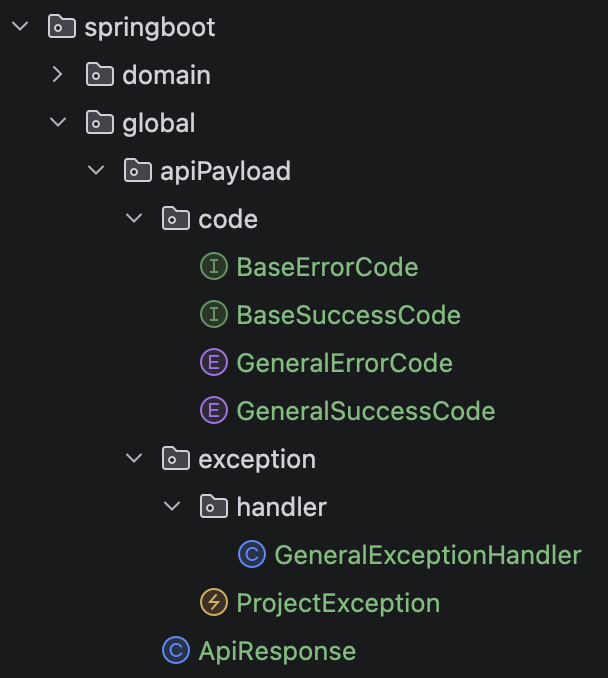
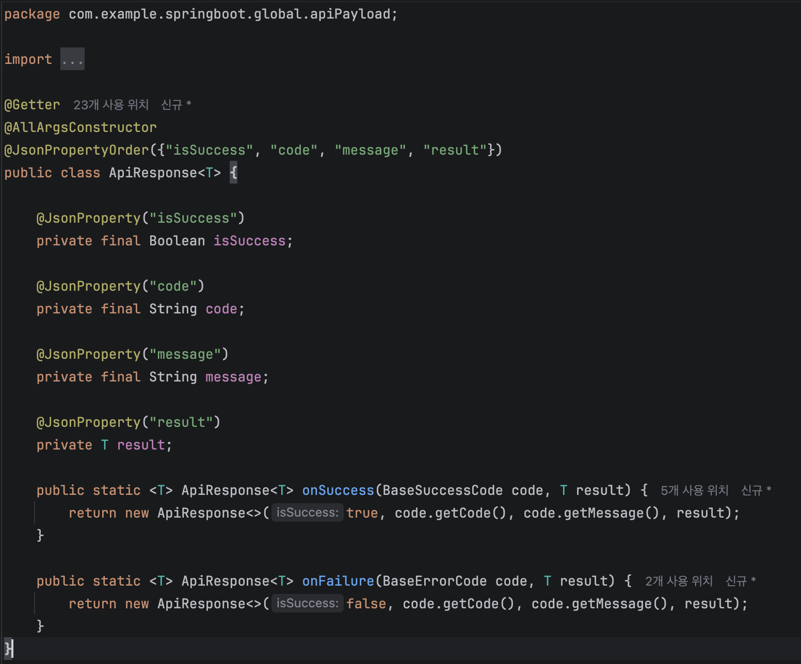
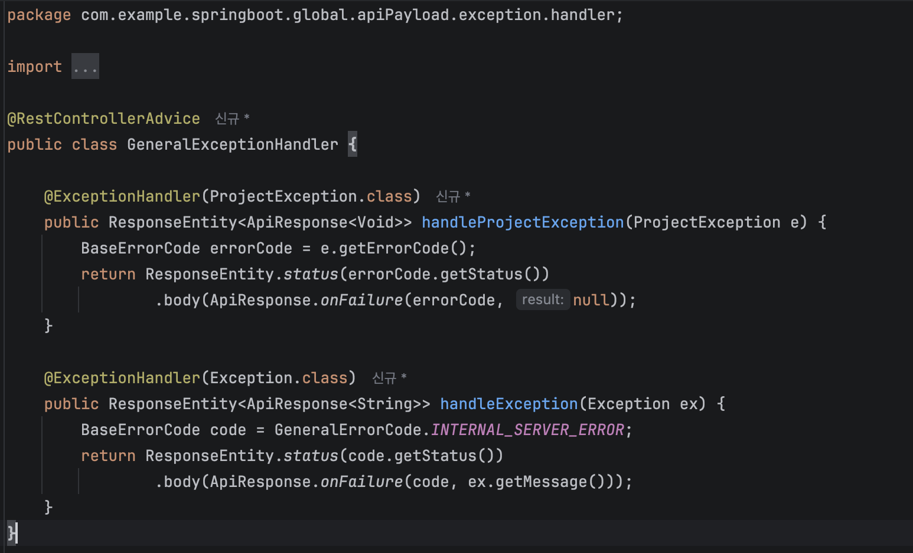
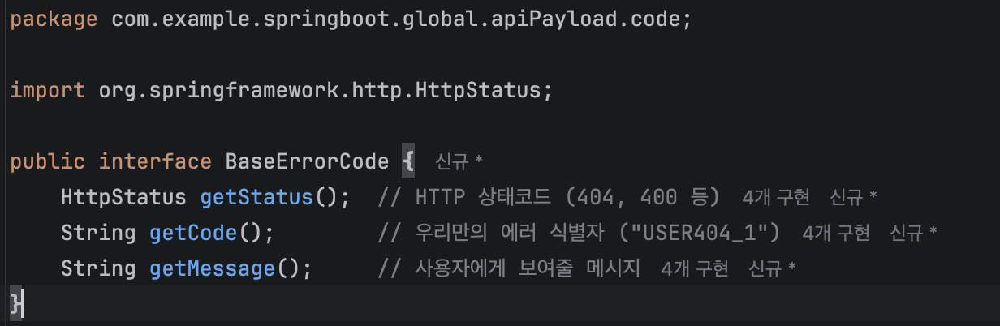
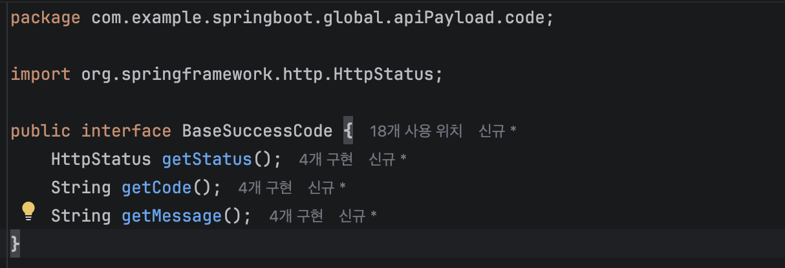
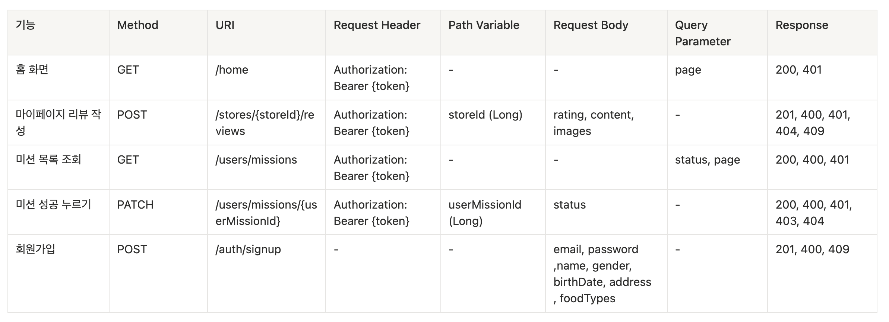
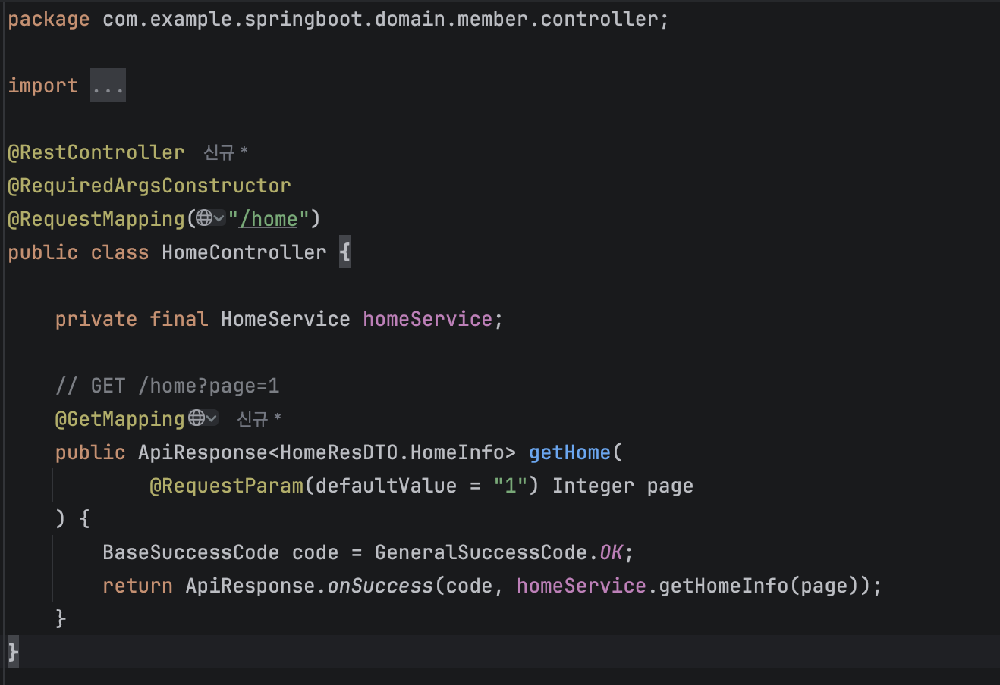

### 1. 학습 후기
이번 키워드는 말로는 도저히 이해가 안돼서 예시 코드와 같이 학습을 진행했습니다.
최대한 코드에서 줄일 수 있는 부분을 줄이면서 정리했습니다.

### 2. 핵심 키워드 정리
#### 1. 빌더 패턴이란?
객체 생성 시 여러 변수들 중 필요한 데이터만 선택하여 초기화 할 수 있게 해주는 패턴입니다.

기존 생성자 방식의 문제
```
public class User {
    private String name;
    private int age;
    private int height;
    private int iq;

    // 전체 다 받는 메인 생성자
    public User(String name, int age, int height, int iq) {
        this.name = name;
        this.age = age;
        this.height = height;
        this.iq = iq;
    }

    // 단점 1: 의미를 알 수 없는 더미(0) 값을 억지로 끼워 넣어야 함
    public static void badExample1() {
        User user = new User("테스트", 0, 181, 121);
    }

    // 단점 2: 이걸 해결하기 위해 '나이 없는 전용 생성자/메서드'를 일일이 또 만들어야 함
    public static User ofWithoutAge(String name, int height, int iq) {
        return new User(name, 0, height, iq); 
    }
}
```

빌더 패턴 사용 시
```
import lombok.Builder;

// 빌더 어노테이션으로 빌더 패턴 적용
@Builder 
public class User {
    private String name;
    private int age;
    private int height;
    private int iq;
}

public class Main {
    public static void goodExample() {
        // 장점 1: 어떤 값이 어떤 데이터인지 한눈에 보임
        // 장점 2: 나이(age)를 안 넣어도 에러가 안 남, 알아서 기본값으로 처리
        User user = User.builder()
                        .name("테스트")
                        .height(181)
                        .iq(121)
                        .build(); 
    }
}
```
빌더 패턴의 장점
- 필요한 데이터만 설정 (더미 데이터를 넣을 필요가 없다)
- 유연성 확보 (클래스에 새로운 변수가 추가되어도 기존 코드에 영향 x)
- 가독성 향샹 (이름이 직관적이다)
- 불변성 확보 (객체가 생성되는 시점에 값을 세팅)

**기존 세터 방식의 문제점 (빌더를 쓰는 또 다른 이유)**
의도 파악 불가 : setPassword()만으로는 비밀번호를 세팅하는건지, 변경하는건지 의도를 알 수 없다.
일관성 유지 실패 : 객체 하나를 생성하기 위해 세터를 여러번 호출하는데 완전이 생성하기 전 다른 곳에서 접근이 가능해 일관성 유지가 어려움.

빌더 패턴을 사용하면 동시에 값을 설정 가능한 생성자를 사용 할 수 있습니다.

빌더 패턴을 사용하는 방법 
방법 1 - 빌더 클래스와 메서드를 직접 정의
방법 2- Lombok의 @Builder 어노테이션 사용 (특정 생성자에 제한적으로 적용 가능)

```
// 방법 1. 직접 Builder 내부 클래스 작성
public class User {
    private String name;

    public static class Builder {
        private String name;
        public Builder name(String name) { this.name = name; return this; }
        public User build() { return new User(this); }
    }
}

// 방법 2. Lombok @Builder
@Builder
public class User {
    private String name;
    private String address;
}
```

#### 2. record vs static class
record는 DTO처럼 데이터를 담기 위한 클래스를 간결하게 만들기 위해 등장했다
```
// static class 방식 → 보일러플레이트가 많음
public static class LoginRequestDto {
    private String email;
    private String password;

    public String getEmail() { return email; }
    public String getPassword() { return password; }
    // equals, hashCode, toString 직접 작성...
}

// record 방식 → 한 줄로 동일한 효과
public record LoginRequestDto(String email, String password) {}
```
#### record의 주요 기능들 

Java Record 자동 생성 기능
- private final : 괄호 안에 선언된 모든 컴포넌트(변수)를 불변 상태로 선언
- 전체 필드 생성자 : 모든 필드를 한 번에 초기화하는 생성자 자동 생성
- Getter 메서드 : get 없이 필드명 그대로 값을 읽어오는 함수 제공
- equals() : 객체의 메모리 주소가 아닌 내부 데이터 값이 같은지 비교
- hashCode() : 데이터를 기반으로 고유 해시값을 생성
- toString() : 클래스명[필드명=값] 형태로 객체를 읽기 쉽게 출력
- final class : 다른 클래스가 상속받지 못하도록 차단

Compact construct
생성자에 조건식을 쉽게 작성 할 수 있는 문법을 제공
```
public record SignupRequest(String email, int age) {
    public SignupRequest {
    if (age < 0) throw new IllegalArgumentException("나이는 음수일 수 없습니다");
        }
    }
```

일반 class처럼 annotation 사용 가능
record도 Bean Validation을 적용시킬 수 있다.
```
public record CreateUserRequest(
    @NotBlank String username,
    @Min(18) int age
) {}
```
생성된 후 값이 바뀌면 안되는 데이터 일 때는 record를 사용, 객체 생성 이후에도 데이터의 상태를 변경해야 할 때 class를 사용합니다.

#### 3. 제네릭
객체 생성 시 타입을 만들 때 지정하지 않고, 나중에 사용 할 때 지정하는 기술입니다.
```
// 제네릭이 없을 경우 타입마다 클래스를 만들어야 함
public class IntegerBox {
    private Integer value;
}
public class StringBox {
    private String value;
}

// 제네릭을 사용할 경우 클래스 하나로 여러 타입을 사용 할 수 있음
public class Box<T> {
    private T value;
    public T get() { return value; }
    public void set(T value) { this.value = value; }
}

Box<Integer> intBox = new Box<>();   // T = Integer로 사용
Box<String>  strBox = new Box<>();   // T = String으로 사용
```

제네릭 T, integer, object, ? 의 차이
```
// T - 처음에는 뭐든지 받을 수 있지만 한번 정해지면 그 타입으로 끝까지 고정된다.
public class Box<T> {... }

// integer/string 등 - 처음부터 해당 타입으로 고정하여 끝까지 고정됨
List<Integer> list = new ArrayList<>();
List<String> list = new ArrayList<>();

// object - 뭐든 담을 수 있지만 구체적인 타입은 기억 못하므로 직접 변환(캐스팅)이 필요하다
List<Object> list = new ArrayList<>();
String s  = (String)  list.get(0);  // 읽을 때 기억 못하므로 캐스팅 해서 사용해야 한다.

public void print(List<?> list) {
    Object o = list.get(0);    // 읽기는 가능 (단, Object로만 나옴)
    // list.add("abc");         // 무슨 타입인지 모르므로(Object로만 인식) 값을 넣는건 금지
}
```

상한 경계 와일드 카드 - ? extend T
```
class Earth {}
class Country extends Earth {}
class Korea extends Country {}
class Japan extends Country {}

class World<T> {
    ...
}

```
```
public void worldOut(World<? extends Country> box) {
Country c = box.getField(); // 꺼내기(Read): 무조건 Country 이상이므로 가능
// box.set(new Country());  // 넣기(Write): 이게 korea인지 japan인지 모르므로 불가능
}
```
하한 경계 와일드 카드 - ? super T
```
public void worldIn(World<? super Country> box) {
    box.set(new Country());     // 넣기(Write): 최소 Country이므로 가능 
    // Country c = box.getField(); // 꺼내기(Read): Object 상자일 수도 있어서 Country 타입으로 꺼내는 건 차단
}
```

| | `? extends T` (상한) | `? super T` (하한) |
|---|---|---|
| 받는 것 | T 이하 자식들 | T 이상 부모들 |
| 읽기(get) | T 타입으로 가능 | Object 타입으로만 가능 |
| 쓰기(set/add) | 불가능 | T 및 자식 타입으로 가능 |
| 주 용도 | 데이터를 꺼내서 쓸 때 | 데이터를 넣을 때 |

제네릭 메서드
클래스가 아닌 메서드 하나에만 제네릭을 적용하는 것
```
// 제네릭 메서드 선언:
public <T> T getFirst(List<T> list) {
    return list.get(0);
}

// 호출할 때마다 T가 새로 결정됨
String s = getFirst(List.of("a", "b"));    // T = String
Integer n = getFirst(List.of(1, 2, 3));    // T = Integer
```

### 4. @RestControllerAdvice란?
모든 Controller에서 발생하는 예외를 한 곳에서 처리하기 위한 어노테이션입니다.
```
// 에러 응답 포맷 표준화
public class ErrorDto {
    private int status;
    private String message;
}

// 예외 상태 코드 enum으로 관리
public enum ExceptionStatus {
    UNAUTHORIZED(401, "인증 실패"),
    FORBIDDEN(403, "권한 없음"),
    NOT_FOUND(404, "리소스 없음");
}

// 커스텀 예외 → RuntimeException 상속 (언체크 예외)
// → throws 선언 불필요, 트랜잭션 자동 롤백
public class CustomException extends RuntimeException {
    private ExceptionStatus status;
}

@RestControllerAdvice
public class GlobalExceptionHandler {

    // 모든 컨트롤러에서 CustomException이 던져지면 여기서 감지
    @ExceptionHandler(CustomException.class)
    public ResponseEntity<ErrorDto> handleCustomException(CustomException e) {
        
        // 1. ExceptionStatus에서 정보 꺼내서 확인
        ExceptionStatus status = e.getStatus(); 
        
        // 2. Error dto에 담음
        ErrorDto error = new ErrorDto(status.getCode(), status.getMessage());
        
        // 3. 클라이언트에게 반환
        return new ResponseEntity<>(error, HttpStatus.valueOf(status.getCode()));
    }
}
```

### 5. Optional
값이 있을 수도 있고 없을 수도 있다는 상황을 명시적으로 표현하는 클래스입니다.
주요 메서드
**생성**
- Optional.empty() : 내부에 아무런 값도 가지지 않는 빈 Optional 객체 생성
Optional<String> emptyBox = Optional.empty();

- Optional.of(value) : null이 아닌 값을 감싸고 있는 Optional 객체 생성
Optional<String> safeBox = Optional.of("Value");

- Optional.ofNullable(value) : null일 수도 있는 값을 감싸는 Optional 객체 생성
String name = null;
Optional<String> flexibleBox = Optional.ofNullable(name); // 널이면 빈 상자 반환

**내부 값 확인 및 조회**
- isPresent() : Optional 객체 내부에 값이 존재하는지 여부를 확인하여 boolean 타입으로 반환
if (fBox.isPresent()) { System.out.println("값 있음"); }

- get() : 값 꺼내기 (비어있는데 꺼내면 에러)
String value = Box.get(); 

**Null에 대한 대체 및 예외 처리**
- orElse()
String result = emptyBox.orElse("기본값입니다");

- orElseGet() : 객체가 비었으면 함수를 실행해서 반환
String result = emptyBox.orElseGet(() -> "결과 반환");

- orElseThrow() : 상자가 비었으면,예외(에러) 처리
String result = emptyBox.orElseThrow(() -> new IllegalArgumentException("데이터가 없습니다"));

### 3. 미션
3-1 .프로젝트 세팅을 마친 상태에서 응답 통일 객체, 에러 핸들링할 객체를 생성하기
(워크북에서 언급 안한 방식으로 생성 시, 그 이유도 함께 기재!)
전체 구조

모든 API 응답을 하나의 포맷으로 통일하기 위한 공통 구조를 먼저 만들었습니다.


ApiResponse<T>는 제네릭을 사용해 API마다 다른 result 타입을 하나의 클래스로 처리했습니다.


@RestControllerAdvice로 모든 예외를 ProjectException.class에서 예외를 처리하도록 UserException, MissionException, ReviewException를 ProjectException을 상속합니다.



나머지 도메인별 에러/성공  코드는 위 인터페이스를 상속받아 동일한 패턴으로 만들었습니다.

3-2. 2주차 미션으로 진행한 API 명세서를 기반으로 Controller, DTO 제작하기

2주차때 만든 api를 보완해서 다시 만들었습니다.


@RestController로 JSON 응답을 반환하고 ApiResponse<HomeResDTO.HomeInfo>로 응답 형식을 통일했습니다. 성공 코드는 GeneralSuccessCode enum으로 사용했습니다.


응답 데이터를 담는 HomeResDTO는 불변 객체라 record로 만들었습니다.

API명세서 기반으로 5개의 API를 모두 구현하고 나머지 Controller/DTO도 각 API에 맞게 동일한 패턴으로 제작했습니다.