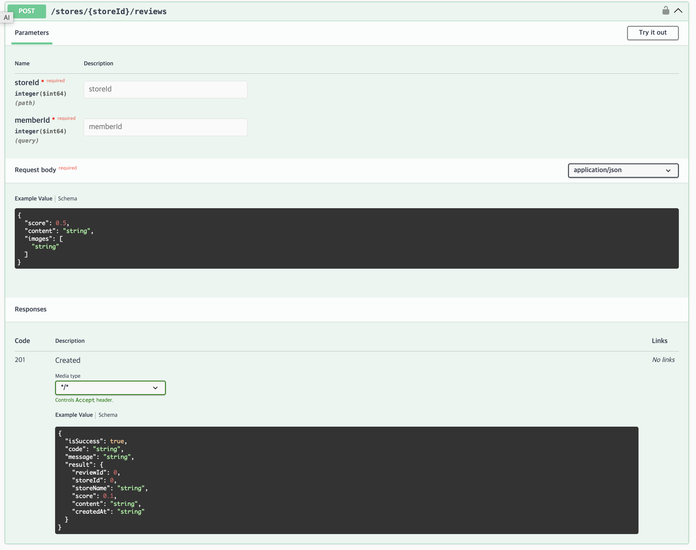
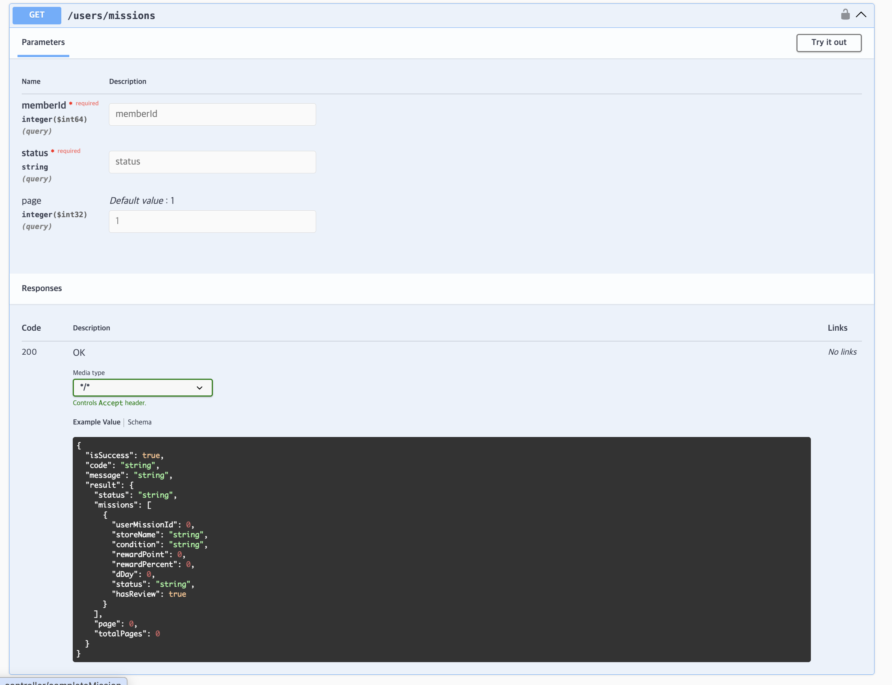
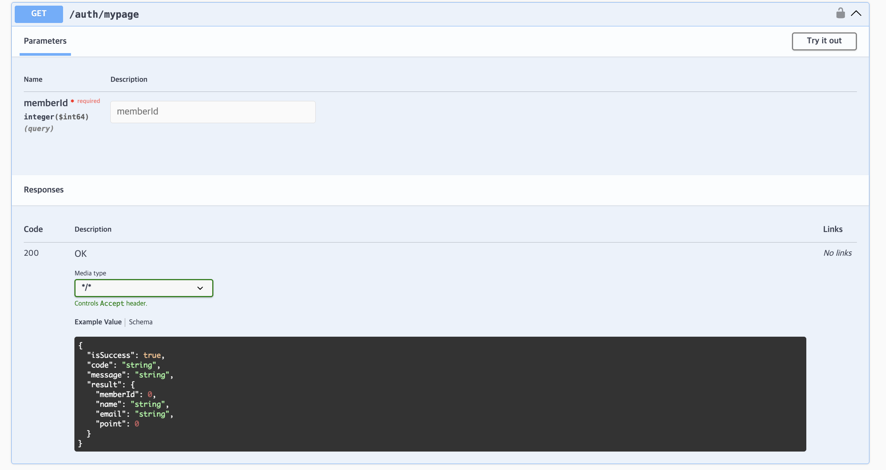
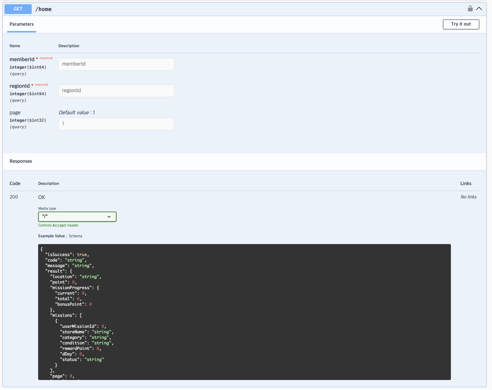

### 1. 학습후기

### 2. 핵심 키워드 정리

#### JPA란?
- 스프링에서 DB연동 시 MyBatis와 같이 많이 사용되는 기술로 자바에서 사용하는 ORM(Object-Relational Mapping) 기술 표준입니다.
- SQL을 직접 작성하지 않고 엔티티와 매핑 정보를 정의하면 CRUD SQL을 자동 생성하고 실행해줍니다.
  
JPA 구성 요소
- Entity : 테이블과 매핑되는 도메인 객체. @Entity 어노테이션 사용.
- EntityManager : 엔티티를 저장/조회/삭제하는 JPA의 핵심 객체.
- Persistence Context(영속성 컨텍스트) : 엔티티를 1차 캐시로 관리하는 논리적인 저장소. (변경감지, 쓰기지연 등)
- Spring Data JPA Repository : JpaRepository를 상속받아 복잡한 기능 없이 CRUD 기능 제공.
- Transaction : @Transactional을 통해 트랜잭션 경계를 관리.

JPA 장점
- 생산성 향상 : SQL 자동 생성 및 JpaRepository 제공
- 유지보수 용이 : 필드 변경 시 SQL을 일일히 수정할 필요가 없음
- 패러다임 불일치 해결 : 객체지향적인 코딩을 해도 JPA가 DB에 맞춰 번역
- 성능 최적화 : 지연로딩(LAZY)를 통해 필요한 시점에만 데이터 조회

JpaRepository와 쿼리 메서드
- 인터페이스에 메서드 이름을 규칙대로 작성 시 Spring이 SQL 생성
ex) findByNameAndDeletedAtIsNull(string name) -> 이름이 일치하고 삭제되지 않은 데이터를 조회

#### N+1 문제란?
- 연관관계가 설정된 엔티티를 조회 시, 1번의 쿼리를 날렸을 때 연관된 데이터를 가져오기 위해 의도하지 않은 N번의 쿼리가 추가적으로 실행되는 것입니다.

N+1 문제는 즉시로딩, 지연 로딩에서 발생

즉시 로딩(EAGER)에서 발생하는 경우
1. JPA가 우선 내가 요청한 엔티티만 찾는 SQL을 실행. (1번 실행)
2. 가져온 후 연관 데이터를 가져오기 위해 하위 엔티티들을 가져오기 위해 N번을 추가 조회 (N번 실행)
3. 2번의 과정으로 N+1 문제 발생

지연 로딩(LAZY)에서 발생하는 경우
1. JPA에서 처음 조회 시에 1번의 쿼리를 실행. (1번 실행)
2. 이후 비즈니스 로직을 돌면서 가져온 엔티티들의 하위의 연관 객체를 사용합니다.이 때 각 객체를 조회
3. 하위 엔티티를 작업 시 추가 조회가 뒤늦게 발생하여 N+1 문제가 발생 (N번 실행)

N+1 문제를 해결하기 위해 Fetch 조인과 EntityGraph를 사용합니다. (설명은 아래서 계속)

#### 지연로딩과 즉시로딩의 차이는?
즉시 로딩(EAGER) : 데이터 조회 시 연관된 데이터까지 한번에 불러오는 것
지연 로딩(LAZY) : 데이터 조회 시 필요한 시점에 연관된 데이터를 불러오는 것

즉시 로딩은 연관된 엔티티를 모두 가져오지만 엔티티 간 관계가 복잡할수록 조인으로 인한 성능 저하가 발생하고 JPQL에서 N+1 문제가 생깁니다.
하이버네이트 공식 가이드 문서에서는 즉시로딩은 좋지 않고, 즉시 로딩을 사용하면 N+1 문제로 이어진다고 되어있습니다. (물론 지연 로딩을 사용한다고 해서 N+1 문제가 완전히 해결되지는 않습니다.)
그러므로 하이버네이트 공식 문서에서는 지연 로딩을 사용하는 것을 권장합니다.

#### JPQL란?
- Java Persistence Query Language. 테이블이 아닌 엔티티 객체를 대상으로 하는 쿼리 언어

JPQL의 특징
- 엔티티 클래스명, 엔티티 필드명의 대소문자가 일치해야 한다(Age!=age)
- JPQL 키워드는 대소문자를 구별하지 않음 (SELECT=select, From=from)
- 테이블 이름을 사용하지 않고 엔티티 이름을 사용
- 별칭이 필수이다.
- SQL을 추상화하여 특정 DB의 SQL에 의존하지 않음 
- JPQL은 SQL로 변환된다.

JPQL의 문법은  SQL 문법과 매우 유사하다
```
select - from - [where] - [group by] - [having] - [orderby]
update - [where]
delete - [where]
```

```
// [SQL] DB의 member 테이블에서 age 컬럼이 18보다 큰 모든 행(Row)을 조회
SELECT * FROM member WHERE age > 18;

// [JPQL] User 엔티티 객체(u)에서 age 필드가 18보다 큰 객체(u) 전체를 조회
SELECT u FROM User AS u WHERE u.age > 18;
```

#### Fetch Join란?
- JPQL에서 성능 최적화를 위해 제공하는 JPA 전용 기능
- 연관된 엔티티나 컬렉션을 여러 쿼리가 아닌 한번의 SQL쿼리로 한꺼번에 조회하여 가져온다.
- JOIN FETCH 키워드로 사용하며 불필요한 추가 쿼리를 방지하여 시스템 성능을 향상
- 지연로딩이라도 FETCH JOIN사용 시 해당 쿼리 시점에 함께 조회됨
```
@Query("SELECT m FROM Member m JOIN FETCH m.team t")
List<Member> findAllWithTeam();
```

#### @EntityGraph란?
- JPA에서 어노테이션으로 간편하게 FETCH JOIN을 사용하는 방법
- JPQL없이 FETCH JOIN을 사용할 수 있음
```
// JPQL 방식
@Query("SELECT m FROM Member m JOIN FETCH m.team")
List<Member> findAllWithTeam();

// @EntitiyGraph 방식
@EntityGraph(attributePaths = {"team"})
List<Member> findAll();
```
간단한 경우 @EntityGraph로 사용할 경우 코드가 간결해지고
복잡한 검색 조건, 정렬 혹은 여러 테이블을 동시에 조인하는 등 쿼리를 세밀하게 조절 할 때 JPQL 방식을 사용합니다.

#### commit과 flush 차이점은?
flush()
- 영속성 컨텍스트의 변경사항을 즉시 DB에 반영, 데이터베이스와 영속성 컨텍스트의 스냅샷을 일치시킵니다.
- 하지만 트랜잭션을 커밋하지 않으므로 에러 발생 시 ROLLBACK이 가능한 단계까지 반영한다.

commit()
- 현재 트랜잭션을 완료하고 모든 변경사항을 확정하는것, 내부적으로 flush()를 수행 후, 실제로 트랜잭션을 커밋한다.
- 커밋이 실행되면 변경 사항이 영구저장되므로 ROLLBACK을 할 수 없다.

| 구분 | flush() | commit() |
|------|---------|----------|
| 실행 시점 | 즉시 데이터베이스에 SQL 실행 | 트랜잭션 종료 시점 |
| 트랜잭션 종료 여부 | 트랜잭션 유지됨 | 트랜잭션 종료됨 |
| 롤백 가능 여부 | 가능 | 불가능(커밋되면 롤백 불가) |
| 내부적으로 flush() 호출 여부 | 명시적으로 호출 필요 | 내부적으로 자동 호출됨 |
| 주요 목적 | 변경 사항을 즉시 반영(트랜잭션 유지) | 변경 사항을 확정하고 트랜잭션을 종료 |

### 3. 미션
리뷰 작성


미션 확인


마이페이지


홈 화면



